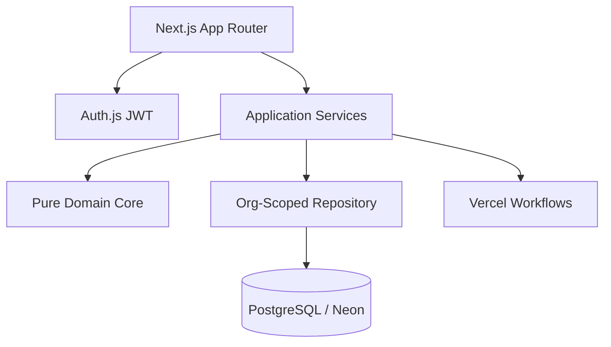

# Shift-Flow

**Open-source lab shift scheduling** — config-driven policy engine สำหรับจัดตารางเวรห้องปฏิบัติการ โดยแยก engine capability ออกจาก site policy ของแต่ละโรงพยาบาล

[](LICENSE)

---

## Mission / พันธกิจ

Shift-Flow ช่วยห้องแล็บจัดตารางเวรอย่างปลอดภัยและตรวจสอบได้ โดย:

- อ่านกติกาจาก **configuration ต่อองค์กร** — ไม่ hardcode รหัสเวรหรือชั่วโมงของแล็บใดแล็บหนึ่ง
- บังคับ **hard safety invariants** (overlap, competency หมดอายุ, รหัสที่ยังไม่ยืนยัน)
- **สองบทบาท:** `SYSTEM_ADMIN` (config) และ `SCHEDULER` (canvas, publish, share)
- แจกจ่ายตารางให้บุคลากรผ่าน **ลิงก์แชร์ read-only** — ไม่ต้อง login แยก
- Canvas popup: เลือกรหัสเวร, วันหยุดทุก kind, สลับ, override พร้อม audit
- Audit trail ครบ lifecycle publish / override / share revoke

---

## Important Disclaimers / ข้อจำกัดความรับผิดชอบ

| หัวข้อ           | คำชี้แจง                                                                           |
| -------------- | ------------------------------------------------------------------------------- |
| **Medical**    | ระบบนี้ **ไม่เก็บ** ข้อมูลผู้ป่วย ผลตรวจ หรือ PHI — เฉพาะบุคลากรและตารางเวร                |
| **Legal**      | **ไม่ใช่** ที่ปรึกษากฎหมายแรงงาน — กติกา OT/พัก/สัญญาเป็นที่ HR และนิติกรของแต่ละหน่วยงานรับรอง |
| **Quality**    | รองรับ competency tracking ตามแนว ISO 15189 แต่ **ไม่รับรอง** การ audit แทนหน่วยงาน  |
| **Pilot data** | ข้อมูลนำร่องจากหน้างานจริงอยู่ local (`pilot-vault/`, gitignore) — **ไม่** อยู่ใน repo     |

---

## Architecture / สถาปัตยกรรม (แผน)



**หลักการ config-driven:**

- **Engine (โค้ด):** rule template registry, validator, deterministic solver, lifecycle
- **Site policy (ข้อมูล):** WorkArea, ShiftCode, CoverageRequirement, RuleInstance ต่อ organization

เอกสารหลัก:

- [`docs/domain/configuration-model.md`](docs/domain/configuration-model.md)
- [`docs/domain/rule-templates.md`](docs/domain/rule-templates.md)
- [`docs/domain/domain-model.md`](docs/domain/domain-model.md)

---

## Quick Start / เริ่มต้นใช้งาน

### 1. Clone และอ่าน docs

```bash
git clone https://github.com/<org>/shift-flow.git
cd shift-flow
```

Platform scaffold (Next.js, Prisma 7, Auth.js, CI) พร้อมใช้งาน — ดู Quick Start ด้านล่าง

### 2. Synthetic demo data

ชุดข้อมูลสังเคราะห์สำหรับ import และทดสอบ validator _(ไม่มี PII)_:

| Starter pack                                                                     | คำอธิบาย                                                                      |
| -------------------------------------------------------------------------------- | --------------------------------------------------------------------------- |
| [`demo/starter-packs/pilot-lab-example/`](demo/starter-packs/pilot-lab-example/) | Pilot Pattern Laboratory (หลาย work area, night codes) — **ต้องปรับก่อนใช้จริง** |

ดู schema และวิธีใช้: [`demo/README.md`](demo/README.md)

### 3. Local development

```bash
pnpm install
cp .env.example .env.local
docker compose up -d
pnpm db:migrate
pnpm db:seed    # synthetic data only
pnpm dev
```

เปิด [http://localhost:3000](http://localhost:3000) — บัญชี seed: `admin.demo` / `demo-change-me`

---

## Roadmap / แผนงาน

| Phase                 | สถานะ     | เนื้อหา                                                                                                   |
| --------------------- | --------- | ------------------------------------------------------------------------------------------------------- |
| Discovery & domain    | ✅ ส่วนใหญ่  | taxonomy, constraint catalog, configuration model                                                       |
| OSS foundation        | ✅         | license, governance, demo data, templates                                                               |
| Platform scaffold     | ✅         | Next.js, Prisma, Auth, CI                                                                               |
| Admin & scheduling UI | 🔜         | config UI, canvas จัดเวร, publish/share (import wizard ถอดแล้ว)        |
| Scheduling core       | 🔜         | validator ✅, optimize Stage A/B บางส่วน, deterministic solver         |
| Staff access          | ✅         | share link read-only (`/s/{token}`) — ไม่มี mobile leave/swap app      |
| Parallel pilot        | ✅ runbook | shadow ≥ 2 รอบ, go-live gate, rollback — [`docs/pilot/parallel-pilot.md`](docs/pilot/parallel-pilot.md) |

เกณฑ์ go-live อัตโนมัติ: `pnpm pilot:evaluate <report.json>` — ดู [`demo/pilot-shadow/README.md`](demo/pilot-shadow/README.md)

---

## Contributing / มีส่วนร่วม

- [`CONTRIBUTING.md`](CONTRIBUTING.md) — workflow, PR checklist, code style
- [`GOVERNANCE.md`](GOVERNANCE.md) — การตัดสินใจ, rule template requests
- [`CODE_OF_CONDUCT.md`](CODE_OF_CONDUCT.md)
- [`SECURITY.md`](SECURITY.md) — รายงานช่องโหว่ (ไม่เปิด public issue)

---

## License

[MIT License](LICENSE) — Copyright (c) 2026 Shift-Flow contributors
