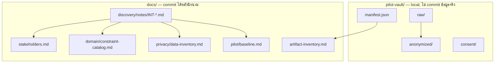
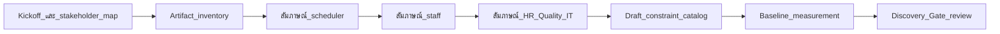

# Fieldwork Pack — Shift-Flow Discovery

> **Stage Gate 0** | เอกสารชุดนี้ใช้ก่อนเขียน domain code  
> **Fieldwork Pack** | Use before writing domain code

เอกสารชุดนี้เป็นชุดเครื่องมือสำหรับลงพื้นที่ห้องแล็บนำร่อง 1 แห่ง เพื่อเก็บข้อมูลเชิงปฏิบัติการก่อนออกแบบระบบจัดตารางเวร Shift-Flow

This pack supports a single pilot laboratory site in Thailand. All artifacts must be **anonymized** before entering the repository.

---

## วัตถุประสงค์ / Objectives

1. ระบุผู้มีส่วนได้ส่วนเสีย บทบาท และผู้ตัดสินใจ
2. เก็บ pain point และ workflow การจัดเวรจริง
3. ทำ inventory ของเอกสาร/ไฟล์ที่ใช้อยู่ (นิรนามก่อน commit)
4. ร่าง constraint catalog ที่ HR/นิติกร/คุณภาพ/DPO รับรองได้
5. บันทึก baseline metrics สำหรับเปรียบเทียบหลัง pilot

---

## ไฟล์ในชุด / Pack Contents

| ไฟล์                                                               | ใช้กับ                               | สถานะ                                      |
| ------------------------------------------------------------------ | ------------------------------------ | ------------------------------------------ |
| [stakeholders.md](./stakeholders.md)                               | แผนที่ผู้มีส่วนได้ส่วนเสีย           | แม่แบบ — กรอกหลัง kickoff                  |
| [interview-scheduler.md](./interview-scheduler.md)                 | ผู้จัดเวร / หัวหน้าเวร               | แม่แบบสัมภาษณ์                             |
| [interview-staff.md](./interview-staff.md)                         | เจ้าหน้าที่ระดับ junior–senior       | แม่แบบสัมภาษณ์                             |
| [interview-quality-hr-it.md](./interview-quality-hr-it.md)         | คุณภาพ, HR/เงินเดือน, นิติกร, IT/DPO | แม่แบบสัมภาษณ์                             |
| [artifact-inventory.md](./artifact-inventory.md)                   | รายการ Excel/แบบฟอร์ม/ปฏิทิน         | checklist เก็บของ                          |
| [clarification-requests.md](./clarification-requests.md)           | คำขอความชัดเจน Q1–Q21                | backlog ถามหน้างาน / ขอ artifact           |
| [../domain/constraint-catalog.md](../domain/constraint-catalog.md) | กติกาจัดเวร                          | ร่างเริ่มต้น + ช่อง sign-off               |
| [../privacy/data-inventory.md](../privacy/data-inventory.md)       | ข้อมูลที่ระบบจะเก็บ                  | ร่างเริ่มต้น                               |
| [../pilot/baseline.md](../pilot/baseline.md)                       | ตัวชี้วัดก่อนใช้ระบบ                 | แบบฟอร์มวัด                                |
| [notes/](./notes/)                                                 | บันทึกราย session (นิรนาม)           | แม่แบบพร้อม — คัดลอกจาก `_templates/`      |
| [../../pilot-vault/](../../pilot-vault/)                           | ไฟล์ดิบ / anonymized / consent       | โครงสร้างพร้อม — **ไม่ commit ข้อมูลจริง** |

---

## ที่เก็บข้อมูล / Data Storage

| ขั้นตอน | ทำอะไร                    | เก็บที่                                             |
| ------- | ------------------------- | --------------------------------------------------- |
| 1       | รับ Excel/PDF จากหน่วยงาน | `pilot-vault/raw/` + อัปเดต `manifest.json`         |
| 2       | บันทึก consent            | `pilot-vault/consent/`                              |
| 3       | สัมภาษณ์ / สังเกตการณ์    | คัดลอก `_templates/` → `notes/INT-*.md`             |
| 4       | Anonymize ไฟล์            | `pilot-vault/anonymized/`                           |
| 5       | สรุปเข้าเอกสารหลัก        | `stakeholders`, `constraint-catalog`, `baseline`, … |
| 6       | ติด index                 | [notes/sessions.md](./notes/sessions.md)            |

**เริ่มต้น:** คัดลอก `pilot-vault/manifest.example.json` → `pilot-vault/manifest.json` (ไฟล์นี้ไม่เข้า git)

---

## ลำดับการลงพื้นที่ / Recommended Sequence

### สัปดาห์ที่ 1

- Kickoff กับหัวหน้าห้องแล็บและผู้จัดเวร
- กรอก `stakeholders.md`
- เริ่ม `artifact-inventory.md` และขอไฟล์ตัวอย่าง (นิรนาม)

### สัปดาห์ที่ 2

- สัมภาษณ์ผู้จัดเวร (60–90 นาที)
- สัมภาษณ์เจ้าหน้าที่ 4–6 คน (กลุ่มละ 30–45 นาที)
- สังเกตการณ์ session จัดเวร 1 ครั้ง (ถ้าอนุญาต)

### สัปดาห์ที่ 3

- สัมภาษณ์ HR/นิติกร, คุณภาพ/ISO, IT/DPO
- ร่าง `constraint-catalog.md` จากข้อมูลที่ได้
- เริ่มวัด `baseline.md` จากรอบตารางล่าสุด

### สัปดาห์ที่ 4

- Workshop ร่วมตรวจ constraint catalog (2 ชั่วโมง)
- ปิด Discovery Gate ตามเกณฑ์ด้านล่าง

---

## Discovery Gate — เกณฑ์ผ่าน

- [ ] ผู้จัดเวร หัวหน้าแล็บ HR/นิติกร ผู้รับผิดชอบคุณภาพ และ DPO/IT **ลงนาม** รับรอง constraint catalog
- [ ] มีข้อมูลตัวอย่างนิรนาม ≥ 2 รอบตาราง รวมเวรก่อน/หลังขอบเขตแต่ละรอบ
- [ ] นิยาม **ชั่วโมงงาน**, **OT**, **วันหยุด**, **เวรดึก**, **เวรต่อเนื่อง**, **ผู้มีอำนาจปฏิบัติงาน** ตรงกันทุกฝ่าย
- [ ] ระบุ rule ที่ห้าม override และ rule ที่ override ได้พร้อมผู้อนุมัติ
- [ ] ยืนยันว่า leave reason เก็บเป็นหมวด operational เท่านั้น ไม่มีรายละเอียดอาการหรือเอกสารสุขภาพ

---

## หลักการความปลอดภัยข้อมูล / Data Safety

- **ห้าม** commit ชื่อจริง รหัสพนักงาน หรือข้อมูลผู้ป่วย
- ใช้รหัสนิรนาม `STAFF-001`, `DEPT-A` แทนตัวตนจริง
- เก็บไฟล์ดิบไว้นอก repo (encrypted storage ของโรงพยาบาล) จน anonymize แล้ว
- บันทึก consent และวันที่เก็บข้อมูลในแต่ละ session สัมภาษณ์
- อ้างอิง [data-inventory.md](../privacy/data-inventory.md) ว่าข้อมูลใดห้ามเก็บ

---

## Sign-off Sheet

| บทบาท                      | ชื่อ (กรอกในที่ทำงาน) | วันที่ | ลายเซ็น |
| -------------------------- | --------------------- | ------ | ------- |
| ผู้จัดเวร / Scheduler      |                       |        |         |
| หัวหน้าห้องแล็บ / Lab Head |                       |        |         |
| HR / นิติกร                |                       |        |         |
| ผู้รับผิดชอบคุณภาพ / ISO   |                       |        |         |
| DPO / IT Security          |                       |        |         |

---

## เอกสารอ้างอิง / References

- ISO 15189:2022 — competence และ authorization
- พ.ร.บ. คุ้มครองข้อมูลส่วนบุคคล พ.ศ. 2562
- นโยบายเวลางานและสัญญาจ้างของสถานพยาบาล (เฉพาะที่ HR/นิติกรรับรอง)
