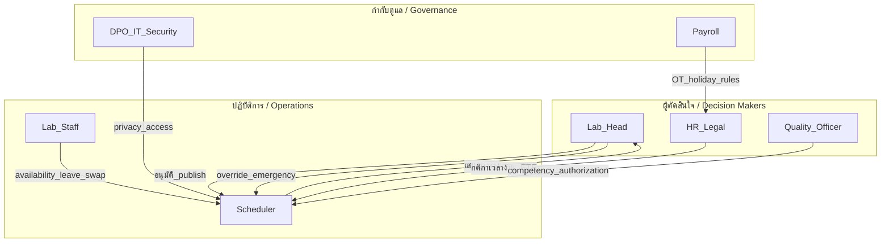

# Stakeholder Map — แผนที่ผู้มีส่วนได้ส่วนเสีย

> อัปเดตล่าสุด: _กรอกวันที่_  
> สถานที่นำร่อง: _ชื่อหน่วยงาน (ไม่ commit ชื่อจริงใน repo จน anonymize)_

---

## 1. ภาพรวม / Overview

เอกสารนี้ระบุผู้มีส่วนได้ส่วนเสียที่เกี่ยวข้องกับการจัดตารางเวรห้องแล็บนำร่อง รวมถึง pain point หลัก อำนาจตัดสินใจ และช่องทางสื่อสาร

---

## 2. แผนที่ความสัมพันธ์ / Relationship Map

---

## 3. รายละเอียดผู้มีส่วนได้ส่วนเสีย / Stakeholder Register

### 3.1 ผู้จัดเวร (Scheduler)

| ฟิลด์                     | รายละเอียด                                                                |
| ----------------------- | ------------------------------------------------------------------------ |
| **รหัสนิรนาม**            | STKH-SCH-001                                                             |
| **บทบาทในระบบ**         | `SCHEDULER`                                                              |
| **ความรับผิดชอบ**         | รวบรวม availability, จัดร่างตาราง, แก้ไข manual, เสนอ publish               |
| **Pain points ที่คาดหวัง** | Excel ซับซ้อน, ตรวจ competency ด้วยมือ, ไม่เห็น coverage gap ทันที, แก้ซ้ำหลายรอบ   |
| **ความต้องการจากระบบ**   | import/export, validator ก่อน publish, แจ้ง conflict ชัดเจน, ประวัติ revision |
| **อำนาจตัดสินใจ**          | draft และ manual edit ใน scope ที่ policy อนุญาต                            |
| **ต้อง consult ใคร**     | Lab Head (publish), HR (OT/holiday), Quality (competency override)       |
| **ช่องทางติดต่อ**          | _กรอกในที่ทำงาน_                                                            |
| **ความถี่ใช้งานที่คาด**      | รายวัน (ช่วงจัดรอบ), รายสัปดาห์ (แก้ swap/emergency)                           |

---

### 3.2 หัวหน้าห้องปฏิบัติการ / ผู้อนุมัติตาราง (Lab Head / Approver)

| ฟิลด์                     | รายละเอียด                                                      |
| ----------------------- | -------------------------------------------------------------- |
| **รหัสนิรนาม**            | STKH-APP-001                                                   |
| **บทบาทในระบบ**         | `APPROVER`                                                     |
| **ความรับผิดชอบ**         | อนุมัติ publish, emergency override, รับรอง coverage และ skill mix |
| **Pain points ที่คาดหวัง** | ไม่มั่นใจว่าตารางผ่านกฎความปลอดภัย, audit trail ไม่ครบ                |
| **ความต้องการจากระบบ**   | safety report, revision diff, acknowledgement tracking         |
| **อำนาจตัดสินใจ**          | publish/lock, override class `APPROVER_REQUIRED`               |
| **ต้อง consult ใคร**     | HR/นิติกร (กติกาแรงงาน), Quality (competency policy)              |
| **ช่องทางติดต่อ**          | _กรอกในที่ทำงาน_                                                  |

---

### 3.3 เจ้าหน้าที่ห้องแล็บ — ระดับ Junior / Middle / Senior (Staff)

| ฟิลด์                     | รายละเอียด                                                     |
| ----------------------- | ------------------------------------------------------------- |
| **รหัสนิรนาม**            | STKH-STF-001 … STKH-STF-00N                                   |
| **บทบาทในระบบ**         | `STAFF`                                                       |
| **ความรับผิดชอบ**         | ปฏิบัติงานตามเวร, แจ้ง availability/leave, ตอบรับ swap/coverage    |
| **Pain points ที่คาดหวัง** | ไม่ทราบตารางล่วงหน้า, ไม่เป็นธรรมเรื่องเวรดึก/วันหยุด, swap ยุ่งยาก       |
| **ความต้องการจากระบบ**   | ดูตารางบนมือถือ, แจ้งลา/ความพร้อมง่าย, รู้เหตุผลเมื่อ preference ไม่ถูกตอบ |
| **อำนาจตัดสินใจ**          | ส่งคำขอ leave/swap/availability เท่านั้น                           |
| **ต้อง consult ใคร**     | Scheduler (ตาราง), Lab Head (กรณีพิเศษ)                         |
| **กลุ่มที่ต้องสัมภาษณ์**       | ≥ 1 junior, ≥ 2 middle, ≥ 1 senior (รวม ≥ 4 คน)               |

---

### 3.4 HR / เงินเดือน / นิติกร (HR & Legal)

| ฟิลด์                     | รายละเอียด                                                                      |
| ----------------------- | ------------------------------------------------------------------------------ |
| **รหัสนิรนาม**            | STKH-HR-001                                                                    |
| **บทบาทในระบบ**         | `PAYROLL_VIEWER` (phase แรก), policy owner                                     |
| **ความรับผิดชอบ**         | กำหนด FTE, OT, วันหยุด, สัญญาจ้าง, รับรองความสอดคล้องนโยบาย                           |
| **Pain points ที่คาดหวัง** | ตารางไม่สะท้อนสัญญา, OT คำนวณไม่ตรง, ไม่มี audit                                      |
| **ความต้องการจากระบบ**   | แยก planned vs actual, export มี version/checksum, ไม่ประกาศว่า “ถูกกฎหมาย” แทน HR |
| **อำนาจตัดสินใจ**          | รับรอง policy rules ใน constraint catalog                                       |
| **ต้อง consult ใคร**     | นิติกร (สัญญา), Payroll (สูตรค่าตอบแทน)                                             |

---

### 3.5 ผู้รับผิดชอบคุณภาพ / ISO 15189 (Quality Officer)

| ฟิลด์                     | รายละเอียด                                                              |
| ----------------------- | ---------------------------------------------------------------------- |
| **รหัสนิรนาม**            | STKH-QA-001                                                            |
| **บทบาทในระบบ**         | policy owner สำหรับ competency                                           |
| **ความรับผิดชอบ**         | competency authorization, supervision, บันทึกการประเมิน, audit ความสามารถ |
| **Pain points ที่คาดหวัง** | ตรวจ authorization ด้วยมือ, หมดอายุ skill ไม่ถูก block                      |
| **ความต้องการจากระบบ**   | hard block เมื่อ competency หมดอายุ, บันทึก approver และวันที่ประเมิน           |
| **อำนาจตัดสินใจ**          | กำหนด rule class `NEVER` สำหรับ unauthorized assignment                   |
| **ต้อง consult ใคร**     | Lab Head (operational exception)                                       |

---

### 3.6 IT Security / DPO

| ฟิลด์                     | รายละเอียด                                                    |
| ----------------------- | ------------------------------------------------------------ |
| **รหัสนิรนาม**            | STKH-IT-001                                                  |
| **บทบาทในระบบ**         | governance, ไม่ใช่ end user หลัก                                |
| **ความรับผิดชอบ**         | PDPA, access control, retention, incident response           |
| **Pain points ที่คาดหวัง** | ข้อมูลกระจายใน Excel/Line, ไม่มี log                             |
| **ความต้องการจากระบบ**   | data minimization, RBAC, audit trail, ไม่เก็บข้อมูลสุขภาพใน leave |
| **อำนาจตัดสินใจ**          | อนุมัติ data inventory และ retention                            |
| **ต้อง consult ใคร**     | HR (employee data), Lab Head (operational need)              |

---

## 4. RACI สรุป / RACI Summary

| กิจกรรม                  | Scheduler | Lab Head | Staff | HR/Legal | Quality | DPO/IT |
| ----------------------- | :-------: | :------: | :---: | :------: | :-----: | :----: |
| ร่างตาราง                |   **R**   |    A     |   C   |    C     |    C    |   I    |
| Publish ตาราง           |     R     |  **A**   |   I   |    I     |    C    |   I    |
| กำหนด competency rule    |     C     |    A     |   I   |    I     |  **R**  |   I    |
| กำหนดเวลางาน/OT/FTE      |     C     |    C     |   I   |  **R**   |    I    |   I    |
| Emergency override      |     R     |  **A**   |   I   |    C     |    C    |   I    |
| Leave approval workflow |     C     |    A     |   R   |    C     |    I    |   I    |
| Data retention policy   |     I     |    C     |   I   |    C     |    I    | **R**  |

_R = Responsible, A = Accountable, C = Consulted, I = Informed_

---

## 5. Pain Point Matrix (กรอกหลังสัมภาษณ์)

| #   | Pain point | ผู้ได้รับผล | ความรุนแรง (1–5) | ความถี่ | หลักฐาน (artifact/quote นิรนาม) | แนวทางระบบ |
| --- | ---------- | ------- | --------------- | ----- | ----------------------------- | ---------- |
| 1   |            |         |                 |       |                               |            |
| 2   |            |         |                 |       |                               |            |
| 3   |            |         |                 |       |                               |            |

---

## 6. Communication Plan

| เหตุการณ์                  | แจ้งใคร            | ช่องทาง                  | SLA                |
| ------------------------ | ----------------- | ----------------------- | ------------------ |
| ตาราง publish แล้ว        | Staff ทั้งหมด       | in-app / email          | ทันที                |
| Emergency coverage       | Staff ที่ eligible  | in-app + โทร (fallback) | ≤ 15 นาที           |
| Competency ใกล้หมดอายุ     | Staff + Scheduler | รายงานรายสัปดาห์          | 7 วันก่อนหมดอายุ      |
| Constraint catalog เปลี่ยน | ทุก stakeholder    | workshop + เอกสาร       | ก่อน effective date |

---

## 7. บันทึกการอัปเดต / Change Log

| วันที่ | ผู้บันทึก | การเปลี่ยนแปลง    |
| --- | ----- | --------------- |
|     |       | สร้างเอกสารเริ่มต้น |
