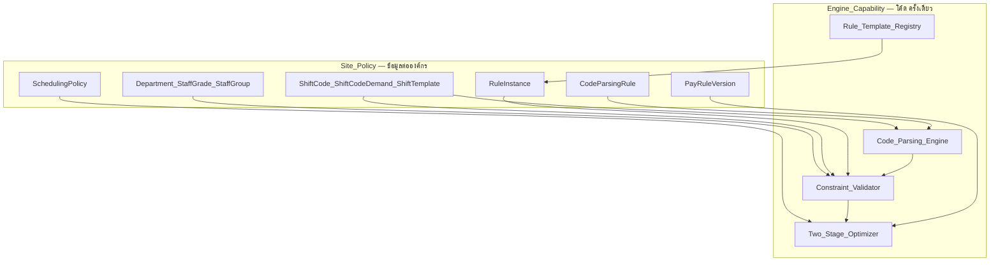
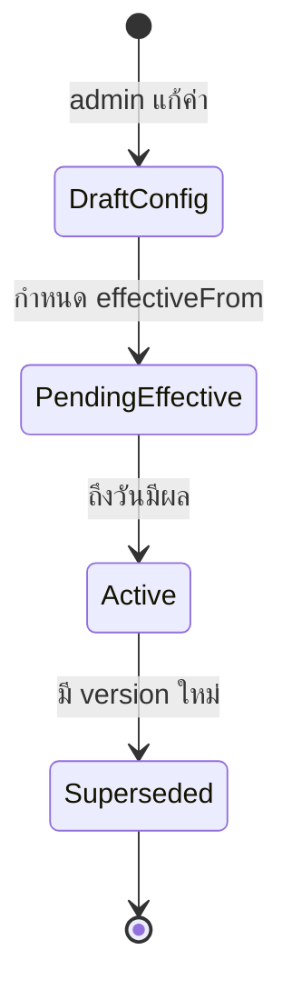

# Configuration Model — แยก Engine Capability จาก Site Policy

> **สถานะ:** Engine Gate ผ่าน — ใช้เป็นแบบออกแบบสำหรับ scaffold และ admin UI  
> **อัปเดต:** 2026-08-11  
> **คู่กับ:** [rule-templates.md](./rule-templates.md) · [constraint-catalog.md](./constraint-catalog.md) · [domain-model.md](./domain-model.md) · [optimization-model.md](./optimization-model.md) · [scheduling-workflow.md](./scheduling-workflow.md)

---

## 1. หลักการ

1. **ค่าที่ต่างกันระหว่างโรงพยาบาล = ข้อมูล** — ไม่ hardcode ใน `src/`
2. **Engine รู้จักเฉพาะชนิดของกฎ** — ไม่รู้จักตัวเลขหรือรหัสเฉพาะแล็บ
3. **Rule template มีพารามิเตอร์** — องค์กรเปิด/ปิดและตั้งค่าได้ผ่าน admin UI
4. **ทุก config มี effective date และ version** — ไม่ย้อนไปเปลี่ยนตารางที่ publish แล้ว
5. **กฎความปลอดภัยหลักปิดไม่ได้** — overlap, competency หมดอายุ, demand บังคับต่อรหัสเวร เป็น hard เสมอ

แล็บนำร่องและข้อมูล OCR ใน [shift-code-taxonomy.md](./shift-code-taxonomy.md) เป็น **ตัวอย่าง** สำหรับ starter pack — ไม่ใช่ค่าเริ่มต้นบังคับของระบบ

---

## 2. สองชั้นของการตั้งค่า



| ชั้น                    | ที่เก็บ                           | ใครแก้               | ตัวอย่าง                                                            |
| --------------------- | ------------------------------ | ------------------- | ----------------------------------------------------------------- |
| **Engine Capability** | โค้ด + registry                 | ผู้พัฒนา (PR + review) | วิธีคำนวณ rest, rolling window, lexicographic priority               |
| **Site Policy**       | PostgreSQL ต่อ `organizationId` | Admin องค์กร         | `minRestHours = 11`, รหัส `N1-MI` เริ่ม 20:00, demand `N1-MI` ≥ 1 คน |

---

## 3. Engine Capability (โค้ด)

สิ่งที่ **เหมือนกันทุกโรงพยาบาล** และ deploy ครั้งเดียว:

| องค์ประกอบ                                     | หน้าที่                                                                                                                      |
| --------------------------------------------- | ------------------------------------------------------------------------------------------------------------------------- |
| [Rule Template Registry](./rule-templates.md) | นิยามชนิดกฎ, Zod schema พารามิเตอร์, ค่า default แนะนำ, override class ที่อนุญาต                                                   |
| Code Parsing Engine                           | อ่าน token ในเซลล์ตาม `CodeParsingRule` ขององค์กร                                                                            |
| Constraint Validator                          | อ่าน `RuleInstance[]` + snapshot ข้อมูล แล้วคืน violation แยก hard/soft                                                        |
| Two-Stage Optimizer                           | Stage A day-off + Stage B balance (min-cost flow + Lagrangian repair); ดู [optimization-model.md](./optimization-model.md) |
| Schedule Lifecycle                            | draft → validated → published → locked; immutable revision                                                                |
| Safety Invariants                             | overlap, leave, competency expiry, unconfirmed code — **NEVER override**                                                  |
| Tenant Boundary                               | `organizationId` บนทุก entity; scoped repository                                                                           |

**จุดขยาย:** template ใหม่เพิ่มที่ `src/domain/rules/` โดยไม่แก้ solver core

---

## 4. Site Policy (ข้อมูลต่อองค์กร)

### 4.1 โครงสร้างองค์กรและบุคลากร

| Entity                         | คำอธิบาย           | หมายเหตุ config                                |
| ------------------------------ | ---------------- | --------------------------------------------- |
| `Organization`                 | tenant           | timezone เริ่มต้น `Asia/Bangkok`                 |
| `Department`                   | แผนก / จุดปฏิบัติงาน | lookup ของรหัสเวร — **ไม่ใช่ enum** องค์กรสร้างเอง |
| `StaffGrade`                   | ระดับพนักงาน       | ชื่อ, ลำดับ, สิทธิ์รหัสที่ใช้ได้                          |
| `StaffGroup`                   | กลุ่ม canvas       | ชื่อ, sortOrder, ขอบเขต fairness และเพดานวันหยุด  |
| `StaffProfile`                 | บุคลากร           | `staffGroupId`, `rowOrder`; แยกจากบัญชี User    |
| `EmploymentContract`           | สัญญา             | FTE, ชั่วโมงเป้า, ประเภท (รวม PT ไม่รับประกันชม.)   |
| `Competency`                   | ทักษะ/activity    | อ้าง ISO 15189                                 |
| `StaffCompetencyAuthorization` | สิทธิ์ปฏิบัติงาน       | ระดับ, ผู้อนุมัติ, วันหมดอายุ, supervision            |

### 4.2 พจนานุกรมรหัสเวร

| Entity            | คำอธิบาย                                                                                               |
| ----------------- | ---------------------------------------------------------------------------------------------------- |
| `ShiftCode`       | รหัส canonical, `departmentId`, เวลา, `isNightShift`, `otHours`, ชม.มาตรฐาน, grades ที่ใช้ได้, สถานะเลิกใช้ |
| `ShiftCodeDemand` | min headcount ต่อรหัสเวร — ใช้เวลาจาก `ShiftCode`; weekday mask, วันหยุด, competency/lead                 |
| `ShiftTemplate`   | รูปแบบเวลา + department + competency requirement                                                      |
| `CodeParsingRule` | กติกา prefix/suffix/composite ขององค์กร (แทน grammar hardcode)                                         |

รหัสที่ยังไม่ยืนยัน: `needsConfirmation = true`, status `UNKNOWN` — **ไม่นำไปคิด demand โดยเดา**

### 4.3 ความต้องการกำลังคน

| Entity              | คำอธิบาย                                                                                                      |
| ------------------- | ----------------------------------------------------------------------------------------------------------- |
| `ShiftCodeDemand`   | min headcount ต่อ `ShiftCode` — ไม่กำหนดช่วงเวลาแยก (ใช้เวลาของรหัส); weekday mask, วันหยุด; อาจระบุ competency/lead |
| `HolidayCalendar`   | วันหยุดองค์กร + version/source                                                                                 |
| `NonWorkingDayKind` | ประเภทวันไม่ขึ้นเวร (off, ลา, ไม่มีสัญญาชม.) — องค์กรกำหนด                                                           |

### 4.4 กฎ นโยบายจัดตาราง และเวอร์ชัน

| Entity              | คำอธิบาย                                                                                                                                     |
| ------------------- | ------------------------------------------------------------------------------------------------------------------------------------------ |
| `SchedulingPolicy`  | `historyWindowMonths`, `fairnessLookbackMonths`, `planningHorizonMonths`, `publishLeadDays`, `otDerivationMode` — effective date + version |
| `RuleInstance`      | อ้าง `ruleTemplateId` + params (JSON ผ่าน Zod), severity, weight, override class, enabled                                                    |
| `RuleSetVersion`    | snapshot ของ rule instance ที่ bind กับ schedule cycle / publish                                                                              |
| `ConfigChangeEvent` | audit ทุกการแก้ config — actor, before/after, effective date                                                                                 |

ค่า default starter pack: `historyWindowMonths = 6`, `fairnessLookbackMonths = 6`, `planningHorizonMonths = 1`

### 4.5 นำเข้า ตาราง และ workload

| Entity                                                | คำอธิบาย                                                                     |
| ----------------------------------------------------- | -------------------------------------------------------------------------- |
| `RosterImportBatch`                                   | ไฟล์ต้นทาง, ผู้ทำ, ผล dry-run                                                   |
| `RosterImportCell`                                    | เซลล์ดิบ + map status (ASSIGNED, OFF, UNKNOWN, …)                            |
| `ScheduleCycle` / `ScheduleDraft` / `ScheduleVersion` | lifecycle ตาราง                                                            |
| `ScheduleRun`                                         | solver: `stage` (`DAY_OFF` \| `BALANCE`), input checksum, rule-set version |
| `PlannedNonWorkingDay`                                | วันหยุดที่วางแผน (Stage A) — `source`, `locked`                                |
| `Assignment`                                          | มอบหมาย + `plannedOtHours`, `isPinned`                                     |
| `StaffWorkloadMonthly`                                | สรุป workload รายเดือน + aggregate หลังหน้าต่างปฏิบัติการ                          |

### 4.6 Payroll (phase หลัง core)

| Entity             | คำอธิบาย                                           |
| ------------------ | ------------------------------------------------ |
| `PayRuleVersion`   | สูตร OT, night/holiday allowance — effective date |
| `ActualAttendance` | แยกจาก planned assignment                        |

---

## 5. RuleInstance — โครงสร้าง

```typescript
// สัญญา conceptual — implement ใน src/domain/config/types.ts

type RuleSeverity = "HARD" | "SOFT";

type OverrideClass =
  | "NEVER" // ห้าม override
  | "APPROVER_REQUIRED" // ต้องมี approver + reason
  | "SCHEDULER_ALLOWED"; // scheduler บันทึกเหตุผลได้

interface RuleInstance {
  id: string;
  organizationId: string;
  ruleTemplateId: string; // อ้าง registry เช่น MIN_REST_BETWEEN_SHIFTS
  params: Record<string, unknown>; // validate ด้วย schema ของ template
  severity: RuleSeverity;
  weight: number | null; // ใช้เมื่อ SOFT; null เมื่อ HARD
  overrideClass: OverrideClass;
  enabled: boolean;
  effectiveFrom: string; // ISO date — เริ่มใช้
  effectiveTo: string | null; // null = ยังมีผล
  version: number; // optimistic lock
  createdAt: string;
  updatedAt: string;
}
```

### ข้อจำกัดด้านความปลอดภัย (engine-enforced)

template ต่อไปนี้ **severity = HARD และ overrideClass = NEVER เสมอ** — admin UI ไม่ให้ปิดหรือ soft ลง:

| Template / Invariant                      | เหตุผล                |
| ----------------------------------------- | -------------------- |
| `NO_TIME_OVERLAP` (engine invariant)      | ข้อมูลทับเวลา           |
| `APPROVED_LEAVE_BLOCK` (engine invariant) | ลาที่อนุมัติแล้ว           |
| `COMPETENCY_VALID_THROUGH_SHIFT`          | ISO / ความปลอดภัยผู้ป่วย |
| `MANDATORY_COVERAGE` (เมื่อเปิดใช้)           | ขาดคนปฏิบัติการ         |
| `UNCONFIRMED_CODE_BLOCKED`                | ไม่เดารหัส UNKNOWN     |

รายละเอียด template ทั้งหมด: [rule-templates.md](./rule-templates.md)

---

## 6. Effective Date และ Versioning



| กฎ                      | พฤติกรรม                                                                     |
| ----------------------- | --------------------------------------------------------------------------- |
| แก้ config               | สร้าง record ใหม่หรือ bump version — ไม่ mutate ย้อนหลัง                          |
| `effectiveFrom` ในอนาคต | แสดงใน admin เป็น "รอมีผล"                                                    |
| Publish schedule        | bind `RuleSetVersion` snapshot — ตารางที่ publish แล้วไม่เปลี่ยนเมื่อ config ใหม่มีผล |
| Republish               | ใช้ rule set ณ วัน publish หรือเลือก rule set ใหม่โดยส conscious                 |

`ConfigChangeEvent` บันทึกทุก mutation: `entityType`, `entityId`, `field`, `before`, `after`, `actorId`, `reason`, `effectiveFrom`

---

## 7. แม็ปจาก Discovery Backlog → Config

คำถาม Q1–Q21 ใน [clarification-requests.md](../discovery/clarification-requests.md) แยกปลายทางดังนี้:

| กลุ่ม                | คำถาม          | ปลายทางในระบบ                                                              |
| ------------------ | ------------- | -------------------------------------------------------------------------- |
| ความหมายรหัส        | Q1–Q7         | ยืนยัน `ShiftCode` canonical + `needsConfirmation` ผ่าน admin config          |
| Pattern / coverage | Q8, Q11       | `PREFERRED_PATTERN`, `REQUIRED_COVERAGE` rule instance + `ShiftCodeDemand` |
| สัญญา / วันไม่ขึ้นเวร   | Q9, Q10       | `EmploymentContract`, `NonWorkingDayKind`                                  |
| Competency         | Q12           | `Competency`, `StaffCompetencyAuthorization`                               |
| ชม.มาตรฐาน         | Q13           | `ShiftCode.standardHours`, `ShiftTemplate`                                 |
| Payroll            | Q14, Q15, Q21 | `PayRuleVersion`, `ActualAttendance` (phase หลัง)                           |
| Artifacts          | Q16–Q20       | validation dataset / import — ไม่บล็อกสถาปัตยกรรม                             |

---

## 8. แม็ป Constraint Catalog → Rule Template

| Constraint Catalog        | Rule Template                               | หมายเหตุ                          |
| ------------------------- | ------------------------------------------- | -------------------------------- |
| HC-001 overlap            | `NO_TIME_OVERLAP` (invariant)               | engine                           |
| HC-002 leave              | `APPROVED_LEAVE_BLOCK` (invariant)          | engine                           |
| HC-003 competency         | `REQUIRED_COMPETENCY_IN_SHIFT`              | safety lock                      |
| HC-004 coverage           | `REQUIRED_COVERAGE`                         | อ้าง `ShiftCodeDemand` ต่อรหัสเวร   |
| HC-005 min rest           | `MIN_REST_BETWEEN_SHIFTS`                   | params: `minRestHours`           |
| HC-006 rolling hours      | `MAX_HOURS_IN_WINDOW`                       | params: window + max             |
| HC-007 consecutive nights | `MAX_CONSECUTIVE_NIGHTS`                    | params: max + night code set     |
| HC-008 night→day          | `FORBIDDEN_CODE_SEQUENCE`                   | params: from/to codes + min rest |
| HC-009 midnight           | engine time model                           | ไม่ใช่ rule instance               |
| HC-010 day-off quota      | `DAY_OFF_QUOTA`                             | Stage A supply                   |
| HC-011 max off per day    | `MAX_STAFF_OFF_PER_DAY`                     | Stage A capacity                 |
| HC-012 OT limit           | `OT_LIMIT`                                  | safety lock; planned OT          |
| SC-001–007                | `FAIR_DISTRIBUTION`, `PREFERRED_PATTERN`, … | soft + weight; carry-over 6 เดือน |

---

## 9. OrganizationConfigSnapshot (runtime)

ตอน validator/solver รัน โหลด snapshot ครั้งเดียว:

```typescript
interface OrganizationConfigSnapshot {
  organizationId: string;
  timezone: string;
  asOf: string; // instant ที่ snapshot ถูกสร้าง
  ruleSetVersionId: string;
  schedulingPolicy: SchedulingPolicy; // historyWindow, fairnessLookback, planningHorizon, otDerivationMode
  departments: Department[];
  staffGrades: StaffGrade[];
  staffGroups: StaffGroup[];
  shiftCodes: ShiftCode[]; // รวม otHours, isNightShift, departmentId
  shiftCodeDemands: ShiftCodeDemand[];
  shiftTemplates: ShiftTemplate[];
  codeParsingRules: CodeParsingRule[];
  ruleInstances: RuleInstance[]; // เฉพาะ enabled + effective ณ asOf
  holidayCalendar: HolidayCalendar;
  staffWorkloadMonthly: StaffWorkloadMonthly[]; // ย้อนหลัง fairnessLookbackMonths
}
```

- **Determinism:** snapshot + solver version → ผลเดิม (integer cost, ไม่พึ่ง seed)
- **Cross-boundary:** snapshot รวม assignment จากรอบก่อน/หลังตาม policy ของ engine

---

## 10. Admin UI (ขอบเขต config)

หน้าตั้งค่าองค์กร **5 หน้า** ภายใต้ `/settings`:

| หน้า         | เส้นทาง                  | จัดการ                                                                                           |
| ----------- | ----------------------- | ----------------------------------------------------------------------------------------------- |
| ภาพรวม      | `/settings`             | สรุป config + ลิงก์ไปหน้าย่อย                                                                        |
| บุคลากร      | `/settings/staff`       | StaffGroup, StaffGrade, StaffProfile, EmploymentContract, Competency                            |
| รหัสเวร      | `/settings/shift-codes` | รหัสเวร, **`ShiftCodeDemand`**, deprecate — แก้ไขผ่าน **Dialog 3 แท็บ** (ข้อมูลรหัส / แผนก / กำลังคนขั้นต่ำ) |
| กติกาเวร     | `/settings/rules`       | เปิด template, ตั้ง params, SchedulingPolicy, preview ผลกระทบ                                      |
| สูตรค่าตอบแทน | `/settings/pay-rules`   | PayRuleVersion (phase หลัง core)                                                                 |

หน้าอื่นที่เกี่ยวข้องแต่ไม่ใช่ config CRUD:

| หน้า             | จัดการ                                                               |
| --------------- | ------------------------------------------------------------------- |
| Schedule Canvas | จัดเวรสองระยะ — ดู [scheduling-workflow.md](./scheduling-workflow.md) |
| Workload        | สถิติ 6 เดือน + รอบปัจจุบัน                                               |
| Parsing Rules   | prefix/suffix/composite (เมื่อ scaffold CodeParsingRule admin)        |
| Audit           | `ConfigChangeEvent` timeline                                        |

ทุกการบันทึก: บังคับ `effectiveFrom` ≥ วันนี้ (หรือ warn ถ้าย้อนหลังสำหรับ draft เท่านั้น)

หน้า `/settings/shift-codes`: ตารางรหัสเวรเป็น **read-only** — กด **แก้ไข** หรือ **เพิ่มรหัสเวร** เปิด Dialog 3 แท็บ: (1) ข้อมูลรหัส (2) ผูกแผนก + CRUD master แผนก (3) กำลังคนขั้นต่ำ (`ShiftCodeDemand`) — เมื่อสร้างรหัสใหม่ แท็บ 2–3 ล็อกจนกว่าจะบันทึกแท็บ 1 สำเร็จ

---

## 11. Starter Pack

ชุดตัวอย่าง import ได้ (ไม่บังคับ) อยู่ที่ `demo/starter-packs/` พร้อม `manifest.yaml`:

| Pack ID             | Alias              | เนื้อหา                                                                                                                                                      | หมายเหตุ            |
| ------------------- | ------------------ | ---------------------------------------------------------------------------------------------------------------------------------------------------------- | ------------------ |
| `pilot-lab-example` | `pilot-lab-sample` | หลาย department, night codes (`N1-MI`/`N1-IM` — รอยืนยันหน้างาน), `staff_groups.csv`, `scheduling_policy.yaml`, `shift_demands.csv`, `otHours` ใน shift codes | **ต้องปรับก่อนใช้จริง** |

Loader: `src/domain/starter-pack/` — `loadStarterPack`, `validateStarterPack`  
Apply: `src/lib/starter-pack/apply-pack.ts` — ใช้จาก seed (`SEED_STARTER_PACK`, default `pilot-lab-example`) หรือ `/settings` (replace config + ล้าง schedule/draft ของ org)

ไฟล์ pack: CSV/YAML ตาม schema ใน `demo/README.md` — ไม่ commit ค่า PII

---

## 12. Quality Gates ที่เกี่ยวกับ Config

| Gate                 | เกณฑ์                                          |
| -------------------- | --------------------------------------------- |
| Configurability test | สอง org สมมติ กติกาต่างกัน — engine เดียว pass ทั้งคู่ |
| Regression           | ไม่มีรหัสเวร/ชื่อแผนก/ชม. ของแล็บนำร่องใน `src/`      |
| Safety               | template ที่ safety lock ปิดไม่ได้ผ่าน UI test      |
| Audit                | ทุก config change มี `ConfigChangeEvent`        |

---

## 13. Change Log

| วันที่        | การเปลี่ยนแปลง                                                                                                |
| ---------- | ----------------------------------------------------------------------------------------------------------- |
| 2026-08-10 | สร้าง configuration model — แยก engine/site, effective date, แม็ป constraint catalog                          |
| 2026-08-11 | เพิ่ม SchedulingPolicy, StaffGroup, planned OT, two-stage optimizer, workload; อัปเดต snapshot และ admin UI    |
| 2026-08-11 | flatten WorkArea → Department; CoverageRequirement → ShiftCodeDemand; admin 5 หน้า — demand อยู่ใน shift-codes |
