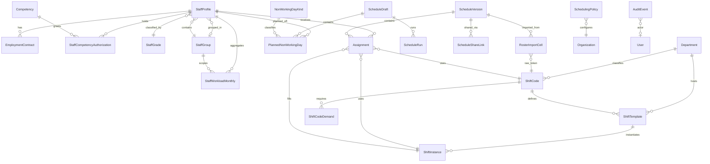

# Domain Model — Shift-Flow

> **สถานะ:** two-role consolidation — Prisma schema ใน `prisma/schema.prisma` เป็น source of truth สำหรับ entity ด้านล่าง  
> **อัปเดต:** 2026-08-11

---

## 1. ER Diagram



**Entity ที่ถอดออก (two-role consolidation):** `LeaveRequest`, `Availability`, `SwapRequest`, `CoverageRequest`, `Acknowledgement` — แทนที่ด้วย canvas popup (`PlannedNonWorkingDay`, swap/override ใน session) และ `ScheduleShareLink` สำหรับการแจกจ่ายตาราง

---

## 2. Entity หลัก (ศัพท์เดิมโปรเจกต์)

| Entity                       | บทบาท                                                                                                                          |
| ---------------------------- | ------------------------------------------------------------------------------------------------------------------------------ |
| StaffProfile                 | บุคลากรในระบบ + `staffGroupId`, `rowOrder`                                                                                      |
| StaffGroup                   | กลุ่มใน canvas + ขอบเขตเกลี่ยงาน (แยกจาก StaffGrade)                                                                               |
| EmploymentContract           | FTE, ชั่วโมงเป้า, ประเภทสัญญา                                                                                                      |
| Department                   | แผนก / จุดปฏิบัติงาน — lookup ของรหัสเวร (**MI และ IM แยกแถว**)                                                                     |
| ShiftTemplate                | รูปแบบเวลา + department + competency                                                                                            |
| ShiftInstance                | instance รายวัน                                                                                                                 |
| Assignment                   | การมอบหมาย planned + `shiftCodeId` (ไม่มี `workAreaId` แยก) + `plannedOtHours`, `isPinned`, `isManualOverride`, `overrideReason` |
| PlannedNonWorkingDay         | วันหยุด/ลาที่วางแผน (Stage A + canvas) — แทน LeaveRequest                                                                          |
| NonWorkingDayKind            | ชนิดวันไม่ขึ้นเวร (`blocksScheduling`)                                                                                              |
| ShiftCodeDemand              | min headcount ต่อรหัสเวร — ใช้เวลาจาก `ShiftCode`                                                                                 |
| Competency                   | ทักษะ/activity                                                                                                                  |
| StaffCompetencyAuthorization | สิทธิ์ปฏิบัติงาน + วันหมดอายุ                                                                                                          |
| StaffWorkloadMonthly         | สรุป workload รายเดือน + aggregate หลังหน้าต่าง 6 เดือน                                                                              |
| SchedulingPolicy             | กรอบเวลา + OT derivation ต่อ org                                                                                                |
| ScheduleDraft                | ตารางที่แก้ได้ + optimisticVersion                                                                                                 |
| ScheduleRun                  | บันทึก solver แยก stage DAY_OFF / BALANCE                                                                                        |
| ScheduleVersion              | รอบตาราง + publish state                                                                                                       |
| ScheduleShareLink            | ลิงก์แชร์ read-only — token hash, expiry, revoke                                                                                  |
| AuditEvent                   | บันทึก override / publish / share                                                                                                |

---

## 3. Entity ใหม่จากข้อมูลจริง

### ShiftCode

รหัสที่พิมพ์ในเซลล์ตาราง + alias OCR

| Field             | ประเภท        | หมายเหตุ                       |
| ----------------- | ------------- | ----------------------------- |
| id                | cuid          |                               |
| canonicalCode     | string        | เช่น `MI20`                    |
| aliases           | string[]      | `Inc`, `inc`                  |
| departmentId      | FK Department | nullable ถ้าเป็น `off`          |
| startHint         | time?         | จาก prefix `7`, `8/`          |
| endHint           | time?         | จาก suffix `18`, `20`         |
| isNightShift      | bool          | เวรดึก — จาก config ไม่เดาจากชื่อ |
| otHours           | Decimal       | ชม. OT ที่มากับรหัส (default 0)   |
| staffGrades       | enum[]        | MT, ASSISTANT, …              |
| needsConfirmation | bool          | INC, Set, N1/N2               |

### RosterImportCell

เซลล์ดิบจากภาพ/Excel ก่อน map เป็น Assignment

| Field             | ประเภท | หมายเหตุ                                 |
| ----------------- | ------ | --------------------------------------- |
| sourceFile        | string | `S__21069856_0.jpg`                     |
| staffCode         | string | นิรนาม STAFF-xxx                         |
| localDate         | date   |                                         |
| rawCode           | string | ตามที่อ่านได้                               |
| parsedShiftCodeId | FK?    | null ถ้า UNKNOWN                         |
| confidence        | enum   | HIGH, MED, LOW                          |
| status            | enum   | ASSIGNED, OFF, LEAVE, UNKNOWN, NO_SHIFT |
| rowIndex          | int    |                                         |
| colIndex          | int    |                                         |

### StaffGrade

| Grade     | แหล่ง OCR | ลักษณะ                   |
| --------- | -------- | ----------------------- |
| HEAD      | หัวหน้า    | `ช`, `off`, `HE`        |
| MT        | MT       | หมุนสถานี, N1/N2          |
| PT        | PT       | sparse                  |
| ASSISTANT | ผู้ช่วย     | F/16, B/17, บด rotation |
| SPECIAL   | พิเศษ     | rotation/สัญญาพิเศษ (TBC) |

### StaffGroup

กลุ่มที่ผู้จัดเวรตั้งชื่อเอง — หัวข้อแถวใน canvas และขอบเขต fairness / เพดานวันหยุด

| Field          | ประเภท | หมายเหตุ                            |
| -------------- | ------ | ---------------------------------- |
| organizationId | FK     | tenant boundary                    |
| code           | string | `@@unique([organizationId, code])` |
| displayName    | string | แก้ได้จาก canvas                     |
| sortOrder      | int    | ลำดับกลุ่ม                             |
| active         | bool   |                                    |

`StaffProfile.staffGroupId` (nullable), `StaffProfile.staffGroupSection` (default `RESULT_CAPABLE`), `StaffProfile.rowOrder` (default 0)

`staffGroupSection` กำหนด manual ต่อคน — แยกจาก `StaffGrade` และ `EmploymentContract` (FTE/สัญญา):

| ค่า                   | ความหมาย                                                      |
| -------------------- | ------------------------------------------------------------- |
| `RESULT_CAPABLE`     | ออกผลได้                                                       |
| `RESULT_NOT_CAPABLE` | ออกผลไม่ได้                                                     |
| `PART_TIME`          | Part time (หมวดแสดงใน canvas — ไม่ derive จาก contract อัตโนมัติ) |

### PlannedNonWorkingDay

ผลลัพธ์ Stage A และการตั้งวันหยุด/ลาใน canvas — **ไม่มี** entity `LeaveRequest` แยก

| Field               | ประเภท | หมายเหตุ                          |
| ------------------- | ------ | -------------------------------- |
| scheduleDraftId     | FK     |                                  |
| staffProfileId      | FK     |                                  |
| localDate           | date   |                                  |
| nonWorkingDayKindId | FK     | อ้าง `NonWorkingDayKind`          |
| source              | enum   | `REQUEST` \| `QUOTA` \| `MANUAL` |
| locked              | bool   | Stage B ห้ามแตะเมื่อ true           |

`@@unique([scheduleDraftId, staffProfileId, localDate])`

### ScheduleShareLink

ลิงก์แชร์ตารางเผยแพร่ — ดู [`docs/security/rbac.md` §5](../security/rbac.md)

| Field             | ประเภท   | หมายเหตุ                             |
| ----------------- | -------- | ----------------------------------- |
| scheduleVersionId | FK       | ต้อง status `PUBLISHED` หรือ `LOCKED` |
| tokenHash         | string   | SHA-256 hex — unique                |
| expiresAt         | instant  | default 90 วันหลังสร้าง                |
| revokedAt         | instant? | เพิกถอนแล้ว = null ไม่ active          |
| createdByUserId   | FK User  | ผู้สร้าง                               |
| viewCount         | int      | นับการเข้าชม                          |
| lastViewedAt      | instant? |                                     |

### StaffWorkloadMonthly

สรุปรายเดือน — ฐานสถิติ workload, carry-over solver, aggregate หลังข้อมูลรายวันหลุดหน้าต่าง

| Field          | ประเภท  | หมายเหตุ            |
| -------------- | ------- | ------------------ |
| organizationId | FK      |                    |
| staffProfileId | FK      |                    |
| yearMonth      | string  | เช่น `2026-08`      |
| staffGroupId   | FK?     | กลุ่ม ณ ช่วงคำนวณ      |
| plannedHours   | Decimal |                    |
| otHours        | Decimal | รวม planned OT     |
| nightCount     | int     |                    |
| weekendCount   | int     |                    |
| holidayCount   | int     |                    |
| workedDays     | int     |                    |
| daysOff        | int     |                    |
| fteAtPeriod    | Decimal | normalize fairness |
| computedAt     | instant |                    |

`@@unique([organizationId, staffProfileId, yearMonth])`

### SchedulingPolicy

ต่อ organization — มี `effectiveFrom` และ version

| Field                  | ประเภท | default starter        |
| ---------------------- | ------ | ---------------------- |
| historyWindowMonths    | int    | 6                      |
| fairnessLookbackMonths | int    | 6                      |
| planningHorizonMonths  | int    | 1                      |
| publishLeadDays        | int    | org-specific           |
| otDerivationMode       | enum   | วิธี derive OT ใน canvas |

### Assignment (ฟิลด์เพิ่ม)

| Field                    | ประเภท  | หมายเหตุ                               |
| ------------------------ | ------- | ------------------------------------- |
| plannedOtHours           | Decimal | OT ที่วางแผนในเซลล์ (default 0)          |
| isPinned                 | bool    | solver Stage B ห้ามแตะ (default false) |
| isManualOverride         | bool    | true เมื่อ override จาก popup/publish   |
| overrideReason           | string? | บังคับเมื่อ bypass hard constraint        |
| overrideApprovedByUserId | FK?     | user ที่ยืนยัน override                   |

### ScheduleRun (ฟิลด์เพิ่ม)

| Field | ประเภท | หมายเหตุ                |
| ----- | ------ | ---------------------- |
| stage | enum   | `DAY_OFF` \| `BALANCE` |

---

### ShiftCodeDemand

ความต้องการกำลังคนขั้นต่ำต่อรหัสเวร — child ของ `ShiftCode` (แทน `CoverageRequirement` แบบช่วงเวลา×area)

| Field                | ประเภท | หมายเหตุ                                     |
| -------------------- | ------ | ------------------------------------------- |
| shiftCodeId          | FK     | อ้างรหัสเวร — ใช้ `startTime`/`endTime` ของรหัส |
| minHeadcount         | int    | จำนวนขั้นต่ำ                                     |
| requiredCompetencyId | FK?    | competency บังคับ (nullable)                  |
| requiresLead         | bool   | ต้องมี lead                                   |
| weekdayMask          | int    | bitmask วันในสัปดาห์ (default 127)             |
| appliesOnHolidays    | bool   | ใช้ในวันหยุดนักขัตฤกษ์                            |
| effectiveFrom/To     | date   | effective date + version                    |

### Department

| Field       | ประเภท | หมายเหตุ                            |
| ----------- | ------ | ---------------------------------- |
| code        | string | `@@unique([organizationId, code])` |
| displayName | string | ชื่อแผนก                             |
| sortOrder   | int    | ลำดับใน admin / canvas               |
| active      | bool   |                                    |

---

## 4. Department seed (MI / IM แยก)

| code | name (provisional) | competency hint |
| ---- | ------------------ | --------------- |
| MI   | Microbiology (TBC) | bench MI        |
| IM   | Immunology (TBC)   | bench IM        |
| BB   | Blood Bank         |                 |
| Bac  | Bacteriology       |                 |
| CH   | Chemistry          |                 |
| HE   | Hematology         |                 |
| INC  | INC station (TBC)  |                 |
| N1   | Night 1 (TBC)      |                 |
| N2   | Night 2 (TBC)      |                 |
| Set  | Set lab (TBC)      |                 |
| F    | Front counter      |                 |
| B    | Set lab B          |                 |
| cs   | CS                 |                 |
| บด   | Overnight bench    |                 |

Demand/competency นับ **MI และ IM คนละแผนก** — ผ่าน `ShiftCode.departmentId` + `ShiftCodeDemand` ต่อรหัส (HC-003, HC-004)

---

## 5. แม็ปฟิลด์จากภาพ → entity

| ฟิลด์ในภาพ          |     มีจริง     | map ไป                                           |
| ----------------- | :----------: | ------------------------------------------------ |
| รหัสพนักงาน (6 หลัก) |      ✓       | StaffProfile.code (off-repo) → STAFF-xxx         |
| ชื่อไทย             |      ✓       | displayName (จำกัดสิทธิ์)                             |
| ลำดับ/กลุ่ม           |      ✓       | StaffGroup (+ StaffGrade สำหรับสิทธิ์รหัส)             |
| วันที่ 1–31          |      ✓       | localDate                                        |
| วันในสัปดาห์         |   ✓ (คำนวณ)   | weekday                                          |
| รหัสเซลล์           |      ✓       | ShiftCode + RosterImportCell.rawCode             |
| bench/area        | ✓ (ใน token) | Department (ผ่าน `ShiftCode.departmentId`)        |
| เวลาเริ่ม/จบ        |  ✓ (บางรหัส)  | ShiftCode start/end + ShiftTemplate              |
| competency        |  ✗ ไม่มีคอลัมน์  | infer จาก Department + grade + `ShiftCodeDemand` |
| หมายเหตุ           |      ✗       | —                                                |
| สีแดง              |  ✓ (marker)  | **ไม่ map**                                       |

---

## 6. คำถามที่ต้องถามหน้างาน

รายการเต็ม Q1–Q21 + ช่องบันทึกคำตอบ: [clarification-requests.md](../discovery/clarification-requests.md)

ชุดสั้นที่บล็อก taxonomy: Q1–Q4, Q8 · ช่องแดงปิดแล้ว (marker เท่านั้น)

---

## 7. ภาคผนวก — สรุป Prisma (อ้างอิงเต็มใน repo)

> Schema จริง: `prisma/schema.prisma` — migration `20260811120000_two_role_and_share_link`

```prisma
enum OrganizationRole {
  SYSTEM_ADMIN
  SCHEDULER
}

model ScheduleShareLink {
  id                String    @id @default(cuid())
  organizationId    String
  scheduleVersionId String
  tokenHash         String    @unique
  expiresAt         DateTime
  revokedAt         DateTime?
  createdByUserId   String
  viewCount         Int       @default(0)
  lastViewedAt      DateTime?
  createdAt         DateTime  @default(now())
  updatedAt         DateTime  @updatedAt
}

// PlannedNonWorkingDay, StaffWorkloadMonthly, SchedulingPolicy — ดู §3 และ schema.prisma
```

---

## 8. Change Log

| วันที่        | การเปลี่ยนแปลง                                                                                                                                      |
| ---------- | ------------------------------------------------------------------------------------------------------------------------------------------------- |
| 2026-08-10 | สร้างจาก OCR + แผน Discovery; เพิ่ม ShiftCode, RosterImportCell, TimeEntry, StaffGrade                                                               |
| 2026-08-11 | เพิ่ม StaffGroup, PlannedNonWorkingDay, StaffWorkloadMonthly, SchedulingPolicy; planned OT + isPinned; อ้าง scheduling-workflow + optimization-model |
| 2026-08-11 | two-role: ถอด Leave/Availability/Swap/Coverage/Acknowledgement; เพิ่ม ScheduleShareLink + override fields                                           |
| 2026-08-11 | flatten WorkArea → Department; CoverageRequirement → ShiftCodeDemand (child ของ ShiftCode); ถอด Assignment.workAreaId                             |
