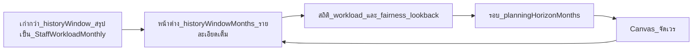
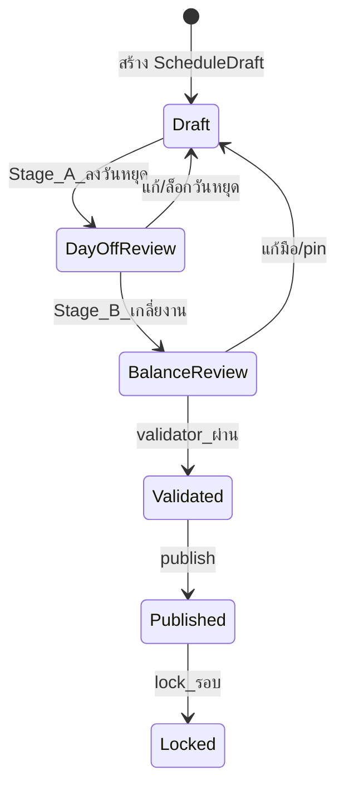
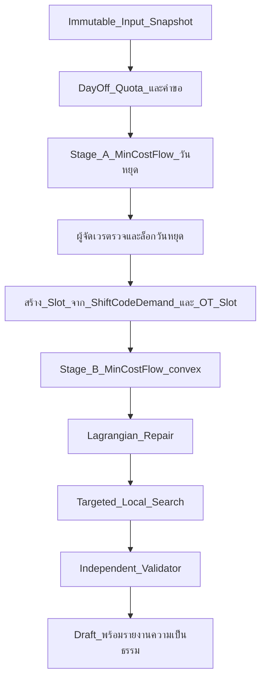
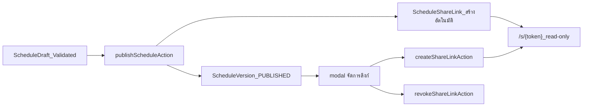

# Scheduling Workflow — สองระยะ + Canvas จัดเวร

> **สถานะ:** ร่างสถาปัตยกรรม — คู่กับ [optimization-model.md](./optimization-model.md)  
> **อัปเดต:** 2026-08-11  
> **UI เป้าหมาย:** `src/app/(authenticated)/schedule/` · `src/components/schedule/canvas/`

---

## 1. หลักการ

- **Canvas เป็นเครื่องมือหลัก** — ผู้จัดเวรแก้ไขได้ตลอด; solver เป็นผู้ช่วยที่เรียกแยกสองระยะ
- **สองระยะไม่ปนกันโดยไม่ตั้งใจ:** Stage B ไม่แตะวันหยุด `locked` และไม่แตะเซลล์ `isPinned`
- **Validate ทันที** ฝั่ง client (incremental) + **revalidate ที่ server** ก่อน commit — client ไม่ใช่ security boundary
- **Config-driven** — ไม่มีรหัสเวร/กลุ่ม/ชม. ของแล็บนำร่องใน `src/`

---

## 2. กรอบเวลาการทำงาน

| การตั้งค่า                  | ค่า default | ผลต่อ workflow                       |
| ------------------------ | ---------- | ----------------------------------- |
| `historyWindowMonths`    | 6          | ข้อมูลที่ query ได้เต็มรายละเอียด          |
| `fairnessLookbackMonths` | 6          | carry-over ใน solver + แผง fairness |
| `planningHorizonMonths`  | 1          | เปิดแก้ได้เพียงรอบถัดไป                  |
| `publishLeadDays`        | org        | แจ้งเตือนก่อน publish                  |

ข้อมูลเก่ากว่าหน้าต่าง → สรุปใน `StaffWorkloadMonthly` ก่อน (ไม่ทำลาย audit ที่ publish แล้ว)

---

## 3. Lifecycle รอบตาราง

| Entity                 | บทบาท                                                                           |
| ---------------------- | ------------------------------------------------------------------------------- |
| `ScheduleCycle`        | รอบปฏิทิน (เช่น 2026-09)                                                           |
| `ScheduleDraft`        | ตารางที่แก้ได้ + `optimisticVersion`                                                |
| `ScheduleVersion`      | snapshot หลัง publish — immutable                                                |
| `ScheduleRun`          | บันทึก solver: `stage` = `DAY_OFF` \| `BALANCE`, input checksum, rule-set version |
| `PlannedNonWorkingDay` | ผล Stage A + canvas — แทน LeaveRequest                                          |
| `Assignment`           | ผล Stage B + แก้มือ — มี `plannedOtHours`, `isPinned`                              |

---

## 4. ลำดับการจัดตารางสองระยะ

### Stage A — ลงวันหยุด

- อินพุต: โควตา (`DAY_OFF_QUOTA`), `PlannedNonWorkingDay` จาก canvas, เพดานต่อวัน (`MAX_STAFF_OFF_PER_DAY`)
- เอาต์พุต: `PlannedNonWorkingDay[]` — ผู้จัดเวร review, ล็อก (`locked = true`) ก่อน Stage B
- รายละเอียดกราฟ: [optimization-model.md §3.1](./optimization-model.md#31-stage-a--วันหยุด-day-off-planning)

### Stage B — เกลี่ยงาน

- อินพุต: slot จาก `ShiftCodeDemand` (ต่อรหัสเวร), OT slot (`ShiftCode.otHours > 0`), carry-over 6 เดือน, pin/locked
- เอาต์พุต: `Assignment[]` + รายงาน fairness
- ไม่แตะ: `PlannedNonWorkingDay.locked`, `Assignment.isPinned`
- รายละเอียด: [optimization-model.md §3.2–§7](./optimization-model.md)

---

## 5. Canvas จัดเวร — สเปก UI

**เส้นทาง:** `src/app/(authenticated)/schedule/[cycleId]/page.tsx`

### 5.1 โครงตาราง

| ส่วน      | พฤติกรรม                                                                                                                                                                 |
| -------- | ----------------------------------------------------------------------------------------------------------------------------------------------------------------------- |
| หัวคอลัมน์  | วันที่ + ชื่อวัน + ธงวันหยุดนักขัตฤกษ์ — **sticky**                                                                                                                                |
| คอลัมน์ซ้าย | รายชื่อคน — **sticky**                                                                                                                                                    |
| กลุ่ม      | แถวหัวข้อจาก `StaffGroup` — ยุบ/ขยาย, เรียงลำดับ, เปลี่ยนชื่อใน canvas                                                                                                            |
| หมวดย่อย  | แถวหัวข้อย่อย 3 ชนิด **ในทุกกลุ่ม** — ออกผลได้ → ออกผลไม่ได้ → Part time (`StaffProfile.staffGroupSection`); ปุ่ม **ซ่อนหมวดว่าง** ใน toolbar ซ่อนเฉพาะหมวดที่ไม่มีคน (จำค่าใน localStorage) |
| ลำดับแถว   | `StaffProfile.rowOrder` ภายในกลุ่มและหมวดย่อย                                                                                                                              |

`StaffGroup` แยกจาก `StaffGrade`: กลุ่ม = ขอบเขตเกลี่ยงานและหัวข้อ UI; grade = สิทธิ์รหัสเวร

### 5.2 การแก้ไข

| การกระทำ     | รายละเอียด                                                                                               |
| ----------- | ------------------------------------------------------------------------------------------------------- |
| คลิกเซลล์     | เปิด popup เลือกรหัสเวร **ทันที** (หัวข้อ + ช่องค้นหา); การจัดอันดับรหัส deferred หลัง paint พร้อม loading ใน popup    |
| Enter/Space | บนเซลล์ที่โฟกัส — เปิด popup เช่นเดียวกับคลิก; ลูกศรยังย้าย selection ระหว่างเซลล์ได้                                  |
| ลาก         | เติมช่วงวัน                                                                                                |
| ลงวันหยุด     | ตัวเลือก `PLANNED_OFF` ใน section **วันหยุด/ลา** ของ popup → `NonWorkingDayKind` จาก config                 |
| ลบวันหยุด     | ปุ่ม **ลบวันหยุด** ใน footer ของ popup (เมื่อเซลล์เป็นวันหยุดและยังไม่ locked)                                      |
| copy/paste  | แถวหรือช่วง                                                                                               |
| undo/redo   | ประวัติการแก้ใน session                                                                                    |
| ล็อกเซลล์     | ปุ่ม **ล็อกเซลล์** ใน footer ของ popup → `Assignment.isPinned` — solver Stage B ห้ามแตะ                      |
| ล็อกวันหยุด    | ปุ่ม **ล็อกวันหยุด** ใน footer ของ popup → `PlannedNonWorkingDay.locked` — Stage A re-run และ Stage B ห้ามแตะ |

**ที่มาวันหยุด (`PlannedNonWorkingDay.source`) และพฤติกรรมเมื่อกด "เกลียววันหยุด":**

| source                      | locked | Stage A re-run                          |
| --------------------------- | ------ | --------------------------------------- |
| `MANUAL` (ลงบน canvas)      | false  | **คงวันเดิม** — solver เติมเฉพาะโควตาที่เหลือ |
| `MANUAL`                    | true   | **คงวันเดิม**                             |
| `REQUEST`                   | false  | **คงวันเดิม**                             |
| `REQUEST`                   | true   | **คงวันเดิม**                             |
| `QUOTA` (จาก solver รอบก่อน) | false  | **แทนที่** — เกลียใหม่ทั้งชุดที่เหลือ             |
| ใด ๆ                        | true   | **คงวันเดิม** — Stage B ก็ห้ามแตะ           |

วันหยุดที่ลงบน canvas ได้ `source = MANUAL` โดยอัตโนมัติ — ไม่ต้องล็อกก่อนเกลียเพื่อคงวัน ยกเว้นต้องการกัน Stage B แตะด้วย

**ไม่มี `<input>` ในเซลล์อีกต่อไป** — การพิมพ์ทำในช่องค้นหาของ popup เท่านั้น; commit ส่ง canonical code ไป server action เดิม (`updateCanvasCellAction` / `setCanvasPlannedDayOffAction`)

#### Popup เลือกรหัสเวร (`ShiftCodePicker`)

- **โดเมน:** `src/domain/schedule/suggest/` — `buildSuggestionBaseline` + `rankShiftCodeCandidates` (pure, ทดสอบได้)
- **UI:** `src/components/schedule/canvas/shift-code-picker.tsx` — Popover ยึดเซลล์, listbox + keyboard (↑↓ Enter Esc)
- **อินพุตจัดอันดับ:** `engineInput` ฝั่ง client — ไม่ round-trip server

**ส่วนใน listbox (ตามลำดับ):**

| Section           | เนื้อหา                                                                |
| ----------------- | -------------------------------------------------------------------- |
| แนะนำ              | รหัสเวร 3 อันดับแรกที่ไม่บล็อก                                              |
| ใช้ได้              | รหัสที่ assign ได้โดยไม่สร้าง HARD ใหม่                                     |
| ใช้ไม่ได้            | รหัสที่บล็อก — แสดง `blockingReasonsTh` (`aria-disabled`)                |
| Override ด้วยเหตุผล | รหัสที่บล็อก — เลือกแล้วกรอกเหตุผล → `isManualOverride` + audit             |
| วันหยุด/ลา          | **ทุก** `NonWorkingDayKind` ที่ active — หนึ่งรายการต่อชนิด (`PLANNED_OFF`) |
| สลับ               | สลับเวรกับคนในกลุ่มเดียวกันวันเดียวกัน (`SWAP_WITH`)                          |
| (ท้ายรายการ)       | `CLEAR` — ล้างเซลล์                                                    |

**Override / emergency coverage (EC-001):** เลือก **Override ด้วยเหตุผล** → ช่องเหตุผลบังคับ → commit ผ่าน `updateCanvasCellAction` พร้อม `override.reason` → `AuditEvent` action `OVERRIDE`

**สลับเวร:** section **สลับ** แสดงคู่ swap ที่ validate incremental ผ่าน — commit สองเซลล์ใน transaction เดียว

**Footer popup (เมื่อยังไม่ locked):**

| ปุ่ม       | เงื่อนไข                             | ผล                                   |
| -------- | ---------------------------------- | ------------------------------------ |
| ล็อกเซลล์  | มี assignment / รหัสเวร และไม่ใช่วันหยุด | `Assignment.isPinned = true`         |
| ลบวันหยุด  | เซลล์เป็น planned off และยังไม่ locked | ลบ `PlannedNonWorkingDay`            |
| ล็อกวันหยุด | เซลล์เป็น planned off                | `PlannedNonWorkingDay.locked = true` |

**โหมด locked:** popup แสดงเหตุผลล็อกและปุ่มปลดล็อก (ไม่จัดอันดับรหัส); เซลล์แสดง **ไอคอนกุญแจสี amber มุมขวาบน** (`CanvasCellLockMarker`) — ทั้ง `isPinned` และ `plannedOffLocked`

#### ลำดับชั้นการเรียง (lexicographic)

| ลำดับ       | คีย์                  | ทิศทาง                 | ที่มา                                                                                                     |
| --------- | ------------------- | --------------------- | ------------------------------------------------------------------------------------------------------- |
| 1         | `blocked`           | ไม่บล็อกก่อน             | `validateIncremental` เทียบ baseline scope `{ staffId, วันก่อน·เป้าหมาย·ถัดไป }` — HARD ใหม่ที่ไม่อยู่ใน baseline  |
| 2         | `coverageGapFilled` | มากก่อน                | demand gap ของวันนั้นจาก assignment ปัจจุบัน + รหัสเวรที่ยังขาด (`ShiftCodeDemand`)                               |
| 3         | `fairnessGain`      | มากก่อน                | `(groupMean − staffMetric) × (standardHours + otHours)` จาก `FAIR_DISTRIBUTION` + `staffFairnessMetric` |
| 4         | `softScoreDelta`    | น้อยก่อน                | soft score ใหม่ − baseline จาก `validateIncremental`                                                     |
| 5         | `recentUsage`       | มากก่อน                | ความถี่ใช้รหัสในรอบปัจจุบันจาก `assignments` (ยังไม่รวม boundary ย้อนหลัง)                                         |
| tie-break | `code`              | `localeCompare("en")` | determinism จาก input เดิม                                                                               |

**กรองก่อนประเมิน:** `!active`, `needsConfirmation`, `!allowedGradeIds.includes(staff.gradeId)` — ไม่แสดงรหัสที่ระดับพนักงานใช้ไม่ได้

**ท้ายรายการเสมอ:** `CLEAR` — ล้างเซลล์ (ไม่รวมใน section วันหยุด/ลา — แต่ละ kind แสดงแยกครบทุกชนิด)

### 5.3 แถบขั้นตอนจัดตาราง (6 step)

แทนแถบปุ่มแบนราบเดิม — แสดง **6 ขั้นตอน** ที่สลับได้อิสระ (ไม่ disable ตามลำดับ) พร้อมไอคอน done เมื่อบรรลุเกณฑ์ของขั้นนั้น และแถวปุ่มบริบทใต้ hint ของ step ที่เลือก

| #   | Step           | โหมด canvas | ปุ่ม/การกระทำในแถวบริบท                                                                                                            |
| --- | -------------- | ----------- | ------------------------------------------------------------------------------------------------------------------------------ |
| 1   | จัดตารางให้สะอาด | `PICKER`    | ซ่อน/แสดงหมวดว่าง                                                                                                                |
| 2   | ลงวันหยุด manual | `PAINT_OFF` | เลือก `NonWorkingDayKind` แล้วคลิก/ลาก toggle วันหยุดบนเซลล์                                                                         |
| 3   | เกลี่ยวันหยุดที่เหลือ | `PICKER`    | เกลียววันหยุด (`runDayOffSolverAction`, Stage A)                                                                                  |
| 4   | เกลี่ยงาน auto   | `PICKER`    | เกลี่ยงาน (`runBalanceSolverAction`, Stage B) — **เติมเวรให้ทุกคนที่ไม่ได้หยุด/ลา หนึ่งเวรต่อวัน** (fill slot) นอกเหนือ `ShiftCodeDemand` ขั้นต่ำ |
| 5   | ปรับแก้อิสระ      | `PICKER`    | คำแนะนำสั้น + ชี้ไปแผงสถานะด้านล่าง                                                                                                    |
| 6   | เผยแพร่         | `PICKER`    | `PublishShareDialog`                                                                                                           |

**เกณฑ์ done ต่อ step (pure function `deriveScheduleStepStates`):**

| Step         | `isDone` เมื่อ                                              |
| ------------ | --------------------------------------------------------- |
| TIDY         | ซ่อนหมวดว่างแล้ว **หรือ** ไม่มีหมวดว่าง                          |
| MANUAL_OFF   | มีเซลล์ `isPlannedOff` อย่างน้อย 1                            |
| AUTO_OFF     | ไม่มี violation `code === "DAY_OFF_QUOTA"` ทั้ง hard และ soft |
| AUTO_BALANCE | `passesCoverage && passesFairness`                        |
| FREE_EDIT    | `passesHard`                                              |
| PUBLISH      | `publishedVersionNumber !== null`                         |

**โหมด `PAINT_OFF` (step 2 และ step 3 เมื่อโควตา/เพดานต่อวันยังไม่ผ่าน):**

- คลิกหรือลากบนเซลล์ — ลง off ชนิดที่เลือก; ถ้าเป็น off ชนิดเดียวกันอยู่แล้ว → ลบ (toggle)
- ข้ามเซลล์ `plannedOffLocked` และ `isPinned`
- ลงวันหยุดทับเซลล์ที่มีเวร → ลบ assignment ในเซลล์เดียวกันอัตโนมัติ (ไม่ให้ทับ `APPROVED_LEAVE_BLOCK`)
- สะสมการเปลี่ยนแปลงระหว่างลาก แล้ว `commitCanvasChangesAction({ plannedOffChanges })` ครั้งเดียวตอนปล่อยเมาส์
- Enter/Space บนเซลล์ที่โฟกัส = toggle วันหยุด (ไม่เปิด popup)
- **หมายเหตุ (เกลี่ยวันหยุดเอง):** commit เฉพาะ planned off ยอมให้ชั่วคราวเกิน `DAY_OFF_QUOTA` หรือ `MAX_STAFF_OFF_PER_DAY` (เช่น วันที่ 2026-09-21 มีคนหยุด 3 คน เกินเพดาน 2) — ให้ **เพิ่มเกินก่อน** แล้วค่อย **ลบวันที่ไม่ต้องการ** ออก

**โค้ด:** `schedule-steps.ts`, `schedule-step-bar.tsx`, `schedule-canvas-toolbar.tsx` (ปุ่มตาม `activeStep`)

แต่ละ solver: แสดง preview + ยืนยันก่อน apply; บันทึก `ScheduleRun` สำหรับ replay

### 5.4 แผงข้าง (sidebar)

- **Violations** — จาก `validateSchedule` / `validateIncremental` (domain pure, รันฝั่ง client)
- **Fairness meter** — ต่อ `StaffGroup`: ชั่วโมง/OT min·max·spread (เดียวกับ solver)
- **Coverage gap** — รายวัน / รหัสเวร (อ้าง `ShiftCodeDemand`)
- **Soft preference** — คำอธิบายว่าทำไม preference ทำไม่ได้

### 5.5 ประสิทธิภาพและ accessibility

- `validateIncremental(context, changedStaffIds, changedDates)` — ไม่ validate ทั้งตารางทุก keystroke
- popup เลือกรหัสเวรไม่บล็อก main thread — จัดอันดับรหัสรัน post-paint (`requestAnimationFrame`) พร้อม stale guard เมื่อสลับเซลล์เร็ว; แสดง `aria-busy` + skeleton ใน popup ระหว่างรอ
- ก่อนจัดอันดับ: trim `assignments` เป็นช่วง ±2 วันของ staff เป้าหมาย + ทุก assignment ในวันเป้าหมาย (demand ต่อรหัส) — performance gate ≤ ~150ms บน validation +25%
- Virtualize แถวเมื่อ staff > ~60
- ภาษาไทย, keyboard-first, WCAG 2.2 AA (axe)
- สีเซลล์จาก config (`ShiftCode.isNightShift`, flags) — ไม่ hardcode รหัส pilot

### 5.6 Commit

- Server Action + `optimisticVersion` ของ `ScheduleDraft`
- Transaction: revalidate hard constraints → บันทึก → audit
- Conflict: แจ้ง merge ถ้า version ไม่ตรง

---

## 6. เผยแพร่และแชร์ตาราง

**UI:** ปุ่ม "เผยแพร่และแชร์" ใน `ScheduleCanvasToolbar` → modal `src/components/schedule/publish-share-dialog.tsx`  
**Actions:** `publishScheduleAction`, `createShareLinkAction`, `revokeShareLinkAction`

| ขั้นตอน        | รายละเอียด                                                                     |
| ------------ | ----------------------------------------------------------------------------- |
| ตรวจความพร้อม | achievement panel — hard violation ต้อง override พร้อมเหตุผลก่อน publish          |
| Publish      | snapshot draft → `ScheduleVersion`; supersede version ก่อนหน้า; audit `PUBLISH` |
| ลิงก์อัตโนมัติ    | หลัง publish สร้าง `ScheduleShareLink` TTL 90 วัน — **token แสดงครั้งเดียว**        |
| แชร์เพิ่ม       | สร้างลิงก์ใหม่ต่อ version ที่ publish แล้ว (1–365 วัน)                                 |
| เพิกถอน       | ตั้ง `revokedAt` — ลิงก์ใช้ไม่ได้ทันที; เกณฑ์ pilot gate `ops.share-link-revoke`        |
| หน้าสาธารณะ   | `/s/{token}` — ไม่ login; `noindex`; แสดงเฉพาะชื่อ + รหัสเวร (ดู rbac §5)          |

สิทธิ์: `schedule:publish`, `schedule:share` — ดู [`docs/security/rbac.md`](../security/rbac.md)

---

## 7. StaffGroup

| ฟิลด์                                     | ความหมาย                                                                        |
| --------------------------------------- | ------------------------------------------------------------------------------- |
| `organizationId`, `code`, `displayName` | ตั้งชื่อเองได้                                                                       |
| `sortOrder`, `active`                   | ลำดับใน canvas                                                                    |
| `StaffProfile.staffGroupId`             | สมาชิกกลุ่ม (nullable)                                                             |
| `StaffProfile.staffGroupSection`        | หมวดย่อยในกลุ่ม — `RESULT_CAPABLE` \| `RESULT_NOT_CAPABLE` \| `PART_TIME` (manual) |
| `StaffProfile.rowOrder`                 | ลำดับแถวในกลุ่ม                                                                     |

กลุ่มเป็นขอบเขตของ:

- `FAIR_DISTRIBUTION` เมื่อ `scope: GROUP`
- `MAX_STAFF_OFF_PER_DAY` capacity ต่อวัน
- รายงาน workload และ fairness meter

---

## 8. Planned OT ใน workflow

1. Admin ตั้ง `ShiftCode.otHours` และ `isNightShift` ใน config
2. Canvas แสดง OT จากรหัส + อนุญาตแก้ `Assignment.plannedOtHours` ตาม `otDerivationMode`
3. Stage B รวม OT ในต้นทุน convex และเช็ค `OT_LIMIT`
4. แผง workload อัปเดตสดเมื่อพิมพ์ — สูตรเดียวกับ `fairness/metrics.ts`

---

## 9. สถิติ workload

**หน้าเต็ม:** `src/app/(authenticated)/schedule/workload/page.tsx`  
**แผงย่อ:** ใน sidebar canvas

| มุมมอง    | เนื้อหา                                                                                       |
| -------- | ------------------------------------------------------------------------------------------- |
| ต่อคน     | ชม.ตามแผน, OT, เวรดึก, สุดสัปดาห์, วันหยุดนักขัตฤกษ์, วันทำงาน/หยุด, เทียบ FTE — 6 เดือนย้อนหลัง + รอบปัจจุบัน |
| ต่อกลุ่ม    | median, min, max, spread, รายชื่อเกิน `toleranceHours`                                         |
| รอบปัจจุบัน | เทียบ `EmploymentContract.targetHoursPerMonth`, OT ใต้เพดาน                                   |
| ส่งออก    | CSV ตาม RBAC — ไม่ข้ามกลุ่มที่ไม่มีสิทธิ์                                                              |

**แหล่งข้อมูล:** `StaffWorkloadMonthly` (เดือนปิดแล้ว) + คำนวณสดจาก draft (รอบที่แก้อยู่)

**วัตถุประสงค์:** ความเป็นธรรมการจัดเวร — ไม่ใช่การประเมินผลงาน (ดู privacy docs)

---

## 10. ความสัมพันธ์กับ import wizard

Import wizard และ payroll **เลื่อนความสำคัญ** หลัง canvas + solver ใหม่ใช้งานได้ — ยังรองรับ `RosterImportCell` สำหรับ onboarding แต่ไม่ใช่เส้นทางหลักของผู้จัดเวรประจำ

---

## 11. โครงสร้างโค้ดที่เกี่ยวข้อง

| มีอยู่แล้ว                            | ใช้ต่อ                                                                    |
| --------------------------------- | ----------------------------------------------------------------------- |
| `src/domain/schedule/validate.ts` | `validateSchedule`, `wouldAssignmentViolateHard`, `validateIncremental` |
| `src/domain/schedule/suggest/`    | `buildSuggestionBaseline`, `rankShiftCodeCandidates` — popup canvas     |
| `src/domain/rules/registry.ts`    | rule templates + validators                                             |
| `src/domain/share/roster-grid.ts` | pivot คน×วัน — ขยายรองรับกลุ่ม + header row                                 |

| ต้องแทนที่ / ใหม่                             | หมายเหตุ                                  |
| ----------------------------------------- | ---------------------------------------- |
| `src/domain/schedule/solver/construct.ts` | greedy — แทนด้วย `src/domain/optimize/`   |
| `src/domain/schedule/solver/search.ts`    | random search — แทนด้วย flow + Lagrangian |
| `src/actions/schedule/publish.ts`         | publish + share link อัตโนมัติ              |
| `src/actions/schedule/share.ts`           | สร้าง/เพิกถอน/รายการลิงก์                    |
| `src/app/s/[token]/page.tsx`              | หน้า share สาธารณะ                        |

| `src/components/share/published-roster-grid.tsx` | ตารางเวรอ่านอย่างเดียวสำหรับหน้า share        |

---

## 12. Change Log

| วันที่        | การเปลี่ยนแปลง                                                                                                                                           |
| ---------- | ------------------------------------------------------------------------------------------------------------------------------------------------------ |
| 2026-08-11 | สร้าง workflow สองระยะ, สเปก canvas, StaffGroup, planned OT, workload                                                                                   |
| 2026-08-11 | canvas: popup เลือกรหัสเวร + ลำดับชั้น suggestion ranking แทนการพิมพ์ในเซลล์                                                                                    |
| 2026-08-11 | canvas: แถบขั้นตอน 6 step + โหมด PAINT_OFF ลงวันหยุด manual แทนแถบเครื่องมือแบนราบ                                                                            |
| 2026-08-11 | canvas: PAINT_OFF ที่ AUTO_OFF เมื่อโควตา/เพดานต่อวันไม่ผ่าน; ลง off ทับเวรลบ assignment; manual planned off ยอมชั่วคราวเกิน DAY_OFF_QUOTA / MAX_STAFF_OFF_PER_DAY |
| 2026-08-11 | Stage B step 4: เกลี่ยงานเติม fill slot ให้ทุกคนที่ไม่ได้หยุด/ลา — สรุป filled/skipped ใน UI                                                                      |
| 2026-08-11 | WorkArea/Coverage → Department/ShiftCodeDemand; slot และ gap อ้าง demand ต่อรหัสเวร                                                                       |
