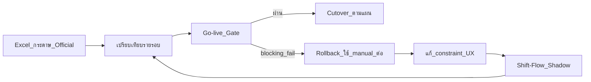

# Parallel Pilot — ทดสอบคู่ขนานและ Go-live Gate

> อัปเดต: 2026-08-13  
> Phase 4 — รัน **shadow** คู่ขนานกับ Excel/กระดาษ ≥ **2 รอบตาราง** ก่อน cutover  
> เกณฑ์อัตโนมัติ: [`src/domain/pilot/go-live-gate.ts`](../../src/domain/pilot/go-live-gate.ts)  
> ตัวชี้วัดรายรอบ: รายงาน JSON ตาม [`src/domain/pilot/schemas.ts`](../../src/domain/pilot/schemas.ts) — รายงานที่มี PII อยู่นอก repo

---

## 1. หลักการ

| หลักการ              | รายละเอียด                                                                              |
| ------------------- | -------------------------------------------------------------------------------------- |
| **Shadow only**     | ตารางใน Shift-Flow เป็น draft/shadow — **Excel/กระดาษยังเป็น source of truth** จน go-live |
| **ไม่ auto-publish** | ผล solver/import **ห้าม** publish เป็น official โดยไม่ผ่านผู้อนุมัติ                            |
| **≥ 2 รอบ**         | ต้องมีอย่างน้อย 2 รอบตาราง (หรือ 1–2 เดือน) ก่อนตัดสิน go-live                                  |
| **Rollback พร้อม**   | ถ้า gate blocking ล้มเหลว → กลับใช้กระบวนการเดิมทันที                                         |



---

## 2. บทบาทและความรับผิดชอบ

| บทบาท         | หน้าที่ใน parallel pilot                                                 |
| ------------- | --------------------------------------------------------------------- |
| **Scheduler** | จัดตารางทั้ง manual และ shadow; publish/share; บันทึกเวลา/revision         |
| **หัวหน้าแล็บ**  | ลงนาม go-live; ตรวจ override/emergency coverage                       |
| **Quality**   | audit hard safety + competency                                        |
| **HR / นิติกร** | ยืนยันกติกา OT/พักไม่ขัดนโยบาย (ไม่ใช่คำปรึกษากฎหมายจากระบบ)                    |
| **DPO / IT**  | restore drill, fallback roster, sign-off ด้านข้อมูล                      |
| **Dev / QA**  | รัน gate evaluator, share link revoke tests, บันทึก deterministic replay |

---

## 3. ขั้นตอนรัน Shadow (ต่อเดือน)

### 3.1 ก่อนเริ่มรอบ

- [ ] เตรียม metadata รอบนี้ในรายงาน JSON (cycle id, ช่วงวันที่, จำนวน staff)
- [ ] Export published roster manual ล่าสุดเป็น fallback (CSV/PDF)
- [ ] ยืนยัน config org (รหัสเวร, coverage, rule instance) ครบและมี effective date
- [ ] รัน restore drill ถ้ายังไม่ผ่านในรอบ pilot นี้ — [`../operations/backup-restore.md`](../operations/backup-restore.md)

### 3.2 ระหว่างจัดตาราง (คู่ขนาน)

1. จัดตาราง **manual** ตามกระบวนการเดิม → publish official ตามปกติ
2. จัดตาราง **shadow** ใน Shift-Flow จาก input เดียวกัน (staff, `PlannedNonWorkingDay` จาก canvas)
3. บันทึกเวลา `schedulingHoursTotal` และ `schedulingHoursActive`
4. เปรียบเทียบ assignment รายวัน — บันทึก diff ที่ตั้งใจ (soft) vs ที่ไม่ยอมรับ (hard)
5. รัน deterministic replay: input + rule version + seed เดิม → ผลต้องเหมือนเดิม 100%

### 3.3 หลัง publish manual

- [ ] รัน validator บน shadow published-equivalent revision
- [ ] นับ hard safety violations, competency, coverage gaps
- [ ] วัด fairness metrics เปรียบ baseline
- [ ] บันทึกตัวชี้วัดรอบนี้ลงรายงาน JSON ตาม schema go-live gate

### 3.4 สิ่งที่ห้ามทำ

- ห้ามให้ staff ใช้ shadow เป็น official จน go-live
- ห้ามปิด Excel/กระดาษก่อนผ่าน gate
- ห้าม override hard safety (competency หมดอายุ, overlap, unconfirmed code) แม้ใน shadow

---

## 4. เกณฑ์ Go-live

### 4.1 Blocking (ไม่ผ่าน → rollback ทันที)

| ID                       | เกณฑ์                                           | Threshold |
| ------------------------ | ---------------------------------------------- | --------- |
| `pilot.min-cycles`       | จำนวนรอบ shadow                                 | ≥ 2       |
| `*.hard-safety`          | Hard safety violations ใน published-equivalent | **0**     |
| `*.competency`           | Authorization ถูกต้อง                            | **100%**  |
| `*.coverage-gap`         | Coverage gap ไม่ได้รับอนุมัติ                        | **0**     |
| `*.deterministic`        | Replay จาก input/rule/seed เดิม                 | **100%**  |
| `*.duplicate-assignment` | Assignment ซ้ำ (swap ใน canvas)                  | **0**     |
| `ops.restore-drill`      | Restore drill                                  | ผ่าน       |
| `ops.fallback-roster`    | Fallback roster พร้อม                           | พร้อม      |
| `ops.share-link-revoke`  | Share link revoke — token ใช้ไม่ได้หลัง revoke     | ผ่าน       |

### 4.2 Non-blocking (ต้องผ่านก่อน cutover แต่ไม่ trigger rollback ทันที)

| ID                          | เกณฑ์                          | Threshold                  |
| --------------------------- | ----------------------------- | -------------------------- |
| `*.scheduling-time`         | ลดเวลาจัดตาราง                 | ≥ **30%**                  |
| `*.fairness`                | Fairness vs manual            | ไม่แย่กว่าทุก metric + ดีขึ้น ≥ 1 |
| `ops.task-success`          | User testing task หลัก         | ≥ **90%**                  |
| `ops.scheduler-self-config` | ตั้งค่ารหัส/coverage เอง          | สำเร็จ                       |
| `ops.synthetic-org-setup`   | Org สมมติจาก docs ภายใน        | ≤ **1 ชม.**                |
| `ops.sign-off`              | HR, หัวหน้าแล็บ, Quality, DPO/IT | ครบ 4 ฝ่าย                  |

---

## 5. Rollback Procedure

เมื่อ **blocking gate** ล้มเหลว หรือเกิด SEV-1 hard safety ใน shadow:

### 5.1 ทันที (≤ 15 นาที)

1. **ยืนยัน Excel/กระดาษ/manual export เป็น source of truth** — staff ไม่เปลี่ยนพฤติกรรม
2. ตั้ง Shift-Flow shadow revision เป็น `Superseded` หรือ read-only
3. แจ้ง scheduler + หัวหน้าแล็บ — ไม่ panic cutover

### 5.2 ภายใน 24 ชม.

1. Root cause: config, validator bug, UX, หรือ training
2. บันทึก incident ตาม [`../operations/incident-response.md`](../operations/incident-response.md) ถ้าเกี่ยวกับ safety
3. แก้ไขและรัน regression + gate tests ใน CI

### 5.3 เริ่ม shadow cycle ใหม่

1. อัปเดต baseline ด้วยบทเรียน
2. รัน shadow รอบใหม่ (นับเป็นครั้งที่ 1 ของ pilot รอบถัดไป)
3. **ไม่** นับรอบที่ล้ม blocking เป็นรอบผ่าน gate

---

## 6. Cutover (เมื่อผ่าน gate ทั้งหมด)

1. กำหนดวัน cutover + communication plan
2. Publish roster รอบแรกใน Shift-Flow เป็น **official**
3. เก็บ Excel archive (read-only) อย่างน้อย 1 รอบเป็น safety net
4. Post-go-live monitoring 2 สัปดาห์ — metrics solver, auth, publish errors

---

## 7. รายงานและเครื่องมือ

### 7.1 รูปแบบรายงาน JSON

Schema: [`src/domain/pilot/schemas.ts`](../../src/domain/pilot/schemas.ts)

แม่แบบรอบ: [`demo/pilot-shadow/reports/cycle-template.json`](../../demo/pilot-shadow/reports/cycle-template.json)

รายงาน pilot จริงเก็บ **นอก repo** (มี PII) — ใช้ schema เดียวกัน

### 7.2 ประเมิน gate

```bash
# รายงานจำลอง (ทดสอบใน repo)
pnpm pilot:evaluate demo/pilot-shadow/reports/simulated-passing-pilot.json

# รายงาน pilot จริง (local path)
pnpm pilot:evaluate /secure/pilot-reports/PILOT-2026-001.json
```

Exit code `0` = ผ่าน go-live, `1` = ไม่ผ่าน

### 7.3 Tests อัตโนมัติ

| Test                    | ที่อยู่                                                        |
| ----------------------- | ---------------------------------------------------------- |
| Go-live gate evaluator  | `tests/unit/pilot-go-live-gate.test.ts`                    |
| Share link token/revoke | `src/domain/schedule/share/token.ts` + manual QA ก่อน pilot |
| Restore drill           | `scripts/backup-restore-drill.sh`                          |
| Tenant boundary         | `tests/integration/tenant-boundary.test.ts`                |

---

## 8. Checklist สรุป Pilot

```markdown
## Parallel Pilot Checklist — PILOT-___

**วันที่เริ่ม:** ___
**วันที่สิ้นสุด:** ___

### รอบ shadow
- [ ] CYCLE-1 ครบ quick capture + JSON metrics
- [ ] CYCLE-2 ครบ quick capture + JSON metrics
- [ ] Deterministic replay ทั้ง 2 รอบ

### Operational
- [ ] Restore drill ผ่าน (บันทึกวันที่)
- [ ] Fallback roster verified
- [ ] Share link revoke tests ผ่าน (สร้าง → revoke → `/s/{token}` 404)
- [ ] User testing ≥ 90%
- [ ] Scheduler self-config สำเร็จ

### Sign-off
- [ ] HR/นิติกร
- [ ] หัวหน้าแล็บ
- [ ] Quality
- [ ] DPO/IT

### Gate evaluation
- [ ] `pnpm pilot:evaluate <report.json>` → PASS
```

---

## 9. เอกสารที่เกี่ยวข้อง

- [`src/domain/pilot/schemas.ts`](../../src/domain/pilot/schemas.ts) — schema ตัวชี้วัดรายรอบ
- [`../operations/backup-restore.md`](../operations/backup-restore.md) — RPO/RTO, restore drill
- [`../operations/incident-response.md`](../operations/incident-response.md) — SEV-1 hard safety
- [`../security/rbac.md`](../security/rbac.md) — สิทธิ์ publish / override
- [`../../demo/pilot-shadow/README.md`](../../demo/pilot-shadow/README.md) — รายงานจำลอง

---

## 10. Change Log

| วันที่        | การเปลี่ยนแปลง                                                      |
| ---------- | ----------------------------------------------------------------- |
| 2026-08-10 | สร้าง runbook parallel pilot + go-live/rollback gate               |
| 2026-08-11 | แทน `ops.swap-concurrency` ด้วย `ops.share-link-revoke` (two-role) |
| 2026-08-13 | ตัด `baseline.md` ค่าจำลอง — ตัวชี้วัดอยู่ในรายงาน JSON ของ gate           |
