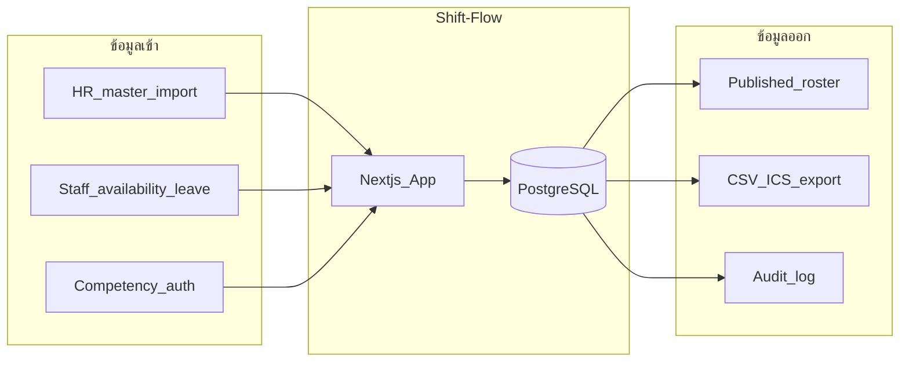

# Data Inventory — บัญชีข้อมูลส่วนบุคคลและข้อมูลปฏิบัติการ

> **สถานะ:** ร่างเริ่มต้น (Draft v0.1) — ต้อง sign-off จาก DPO/HR ก่อน scaffold  
> **กฎหมายอ้างอิง:** พ.ร.บ. คุ้มครองข้อมูลส่วนบุคคล พ.ศ. 2562  
> **ขอบเขต:** ห้องแล็บนำร่อง — ไม่เก็บข้อมูลผู้ป่วยหรือผลตรวจ

---

## 1. หลักการ (Data Minimization)

1. เก็บเฉพาะข้อมูลที่จำเป็นต่อการจัดเวร ความปลอดภัย และ audit
2. **ไม่เก็บ** ข้อมูลสุขภาพ อาการ การวินิจฉัย หรือเอกสารทางการแพทย์ใน leave workflow
3. แยก planned assignment ออกจาก actual attendance ใน phase payroll
4. ทุก field มี owner, purpose, retention และสิทธิ์เข้าถึงชัดเจน

---

## 2. ข้อมูลที่ห้ามเก็บ (Prohibited Data)

| ข้อมูล                             | เหตุผล                    | ทางเลือกที่อนุญาต                          |
| -------------------------------- | ------------------------ | -------------------------------------- |
| รายละเอียดอาการ/การวินิจฉัย          | PDPA + ไม่จำเป็นต่อการจัดเวร  | หมวด leave เช่น "ลาป่วย" โดยไม่มีรายละเอียด |
| ใบรับรองแพทย์ / เลขที่เอกสารแพทย์     | sensitive health data    | เก็บในระบบ HR แยกต่างหาก                 |
| ข้อมูลผู้ป่วย (HN, ชื่อ, ผลตรวจ)        | นอกขอบเขตโครงการ         | —                                      |
| เลขบัตรประชาชน / บัญชีธนาคาร        | ไม่จำเป็นต่อ scheduling core | HRIS / payroll system                  |
| รหัสผ่าน plain text                | security                 | Argon2id hash เท่านั้น                    |
| Push token แบบ log ใน plain text | security                 | เก็บ encrypted / redacted ใน log        |

---

## 3. บัญชีข้อมูล (Data Register)

### 3.1 Identity & Access

| Entity                 | Field        | ประเภทข้อมูล   | Purpose        | Legal basis (PDPA)          | Access roles          | Retention               |
| ---------------------- | ------------ | ------------ | -------------- | --------------------------- | --------------------- | ----------------------- |
| User                   | username     | ข้อมูลระบุตัว    | login          | ฐานสัญญา/legitimate interest | Self, SYSTEM_ADMIN    | ตลอด account + 1 ปีหลังปิด |
| User                   | passwordHash | security     | authentication | ฐานสัญญา                     | ระบบเท่านั้น             | ตลอด account            |
| User                   | displayName  | ข้อมูลระบุตัว    | แสดงใน UI      | ฐานสัญญา                     | STAFF+ ในหน่วยงาน      | ตาม account             |
| OrganizationMembership | role         | ไม่ sensitive | authorization  | ฐานสัญญา                     | SYSTEM_ADMIN, AUDITOR | ตาม membership          |

### 3.2 Staff & Employment

| Entity             | Field            | ประเภทข้อมูล   | Purpose              | Access roles              | Retention                       |
| ------------------ | ---------------- | ------------ | -------------------- | ------------------------- | ------------------------------- |
| StaffProfile       | staffCode        | pseudonym    | อ้างอิงภายใน           | SCHEDULER, APPROVER       | ตลอด employment + 7 ปี audit     |
| StaffProfile       | displayName      | ข้อมูลระบุตัว    | roster               | STAFF+                    | ตาม employment                  |
| StaffProfile       | contactPhone     | ข้อมูลติดต่อ     | emergency (optional) | SCHEDULER, APPROVER, Self | ตาม employment; ลบเมื่อไม่ consent |
| EmploymentContract | fte, hoursTarget | ไม่ sensitive | fairness, coverage   | SCHEDULER, HR viewer      | ตาม contract + audit period     |
| EmploymentContract | contractType     | ไม่ sensitive | rule application     | SCHEDULER, HR viewer      | ตาม contract                    |

### 3.3 Competency

| Entity                       | Field                 | ประเภทข้อมูล   | Purpose               | Access roles     | Retention            |
| ---------------------------- | --------------------- | ------------ | --------------------- | ---------------- | -------------------- |
| Competency                   | name, code            | ไม่ sensitive | coverage matching     | STAFF+           | ตลอดใช้งานระบบ        |
| StaffCompetencyAuthorization | level                 | ไม่ sensitive | assignment validation | STAFF+, Quality  | ตาม ISO record + 7 ปี |
| StaffCompetencyAuthorization | assessedAt, expiresAt | ไม่ sensitive | validity check        | STAFF+, Quality  | ตาม ISO              |
| StaffCompetencyAuthorization | approverId            | ข้อมูลระบุตัว    | audit                 | Quality, AUDITOR | ตาม ISO              |

### 3.4 Availability & Leave

| Entity       | Field             | ประเภทข้อมูล       | Purpose          | Access roles              | Retention        |
| ------------ | ----------------- | ---------------- | ---------------- | ------------------------- | ---------------- |
| Availability | type (hard/soft)  | ไม่ sensitive     | scheduling input | Self, SCHEDULER           | 12 เดือนหลัง cycle |
| LeaveRequest | category          | หมวด operational | block assignment | Self, SCHEDULER, APPROVER | 3 ปี (ปรับตาม HR)  |
| LeaveRequest | start/end         | ไม่ sensitive     | block assignment | Self, SCHEDULER           | 3 ปี              |
| LeaveRequest | status            | ไม่ sensitive     | workflow         | Self, SCHEDULER           | 3 ปี              |
| LeaveRequest | ~~symptomDetail~~ | **ห้ามเก็บ**       | —                | —                         | —                |

**หมวด leave ที่อนุญาต (operational):**

- ลาพักร้อน
- ลากิจ
- ลาฉุกเฉิน
- ลาอบรม/ประชุม
- ลาคลอด/บิดา (ไม่เก็บรายละเอียดทางการแพทย์)
- ไม่ระบุ (ต้อง consult HR — จำกัดผู้ดู)

### 3.5 Scheduling

| Entity                        | Field                | ประเภทข้อมูล   | Purpose         | Access roles       | Retention |
| ----------------------------- | -------------------- | ------------ | --------------- | ------------------ | --------- |
| ScheduleVersion               | publishedAt, status  | ไม่ sensitive | roster truth    | STAFF+             | 7 ปี       |
| Assignment                    | staffId, shift, area | ไม่ sensitive | roster          | STAFF+             | 7 ปี       |
| ScheduleRun                   | inputChecksum, seed  | ไม่ sensitive | reproducibility | SCHEDULER, AUDITOR | 2 ปี       |
| SwapRequest / CoverageRequest | participants, status | ไม่ sensitive | workflow        | ที่เกี่ยวข้อง           | 2 ปี       |

### 3.6 Audit & Security

| Entity     | Field                  | ประเภทข้อมูล   | Purpose    | Access roles | Retention |
| ---------- | ---------------------- | ------------ | ---------- | ------------ | --------- |
| AuditEvent | actor, action, diff    | อาจมี PII     | compliance | AUDITOR, DPO | 7 ปี       |
| Auth log   | IP (masked), timestamp | ไม่ sensitive | security   | DPO, IT      | 90 วัน     |

---

## 4. Data Flow Diagram

**หมายเหตุ:** ไม่มี flow จากระบบไปยัง HRIS โดยตรงในรุ่นแรก

---

## 5. สิทธิ์ของเจ้าของข้อมูล (Data Subject Rights)

| สิทธิ์                 | วิธีดำเนินการ                      | ผู้รับผิดชอบ          | SLA        |
| ------------------- | ------------------------------ | ----------------- | ---------- |
| ขอเข้าถึง             | คำขอผ่าน HR/DPO → export จากระบบ | DPO               | 30 วัน      |
| แก้ไข                | แก้ผ่าน admin/HR verified        | HR + SYSTEM_ADMIN | 14 วัน      |
| ลบ                  | หลัง retention หรือ anonymize    | DPO               | ตาม policy |
| คัดค้าน / ถอน consent | จำกัด contact fields             | DPO               | 30 วัน      |

---

## 6. การโอนข้อมูล / Processors

| Processor | บริการ      | ข้อมูลที่ส่ง          | มาตรการ                              |
| --------- | ---------- | ---------------- | ------------------------------------ |
| Vercel    | hosting    | request metadata | DPA, TLS                             |
| Neon      | PostgreSQL | ข้อมูลทั้งหมดใน DB   | encryption at rest, branch isolation |

---

## 7. Logging & Metrics — Redaction Rules

**ห้าม log:**

- password, reset token, session token
- รายละเอียด leave ที่เป็น sensitive
- full IP (ใช้ /24 mask หรือ hash)

**อนุญาต log:**

- correlation ID, organization ID, user ID (internal)
- solver duration, workflow status
- auth failure count (ไม่ระบุ username ใน info level)

---

## 8. Discovery Gate — Sign-off

| Section            |  HR   | DPO/IT | Lab Head | Quality |
| ------------------ | :---: | :----: | :------: | :-----: |
| Prohibited data §2 |   ☐   |   ☐    |    ☐     |    ☐    |
| Data register §3   |   ☐   |   ☐    |    ☐     |    ☐    |
| Retention          |   ☐   |   ☐    |    ☐     |    ☐    |
| Processors §6      |   ☐   |   ☐    |    ☐     |    ☐    |

**วันที่ sign-off:** ___________

---

## 9. Change Log

| วันที่        | Version    | การเปลี่ยนแปลง |
| ---------- | ---------- | ------------ |
| 2026-08-10 | v0.1-draft | สร้างร่างเริ่มต้น |
