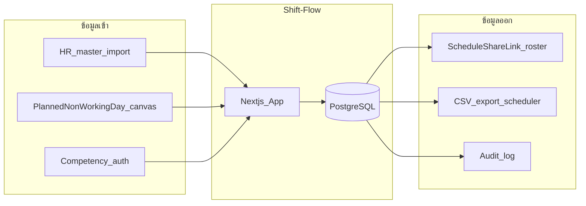

# Data Inventory — บัญชีข้อมูลส่วนบุคคลและข้อมูลปฏิบัติการ

> **สถานะ:** ร่างเริ่มต้น (Draft v0.1) — ต้อง sign-off จาก DPO/HR ก่อน scaffold  
> **กฎหมายอ้างอิง:** พ.ร.บ. คุ้มครองข้อมูลส่วนบุคคล พ.ศ. 2562  
> **ขอบเขต:** ห้องแล็บนำร่อง — ไม่เก็บข้อมูลผู้ป่วยหรือผลตรวจ

---

## 1. หลักการ (Data Minimization)

1. เก็บเฉพาะข้อมูลที่จำเป็นต่อการจัดเวร ความปลอดภัย และ audit
2. **ไม่เก็บ** workflow ลา/availability/swap/coverage แยก — วันหยุด/ลาอยู่ใน `PlannedNonWorkingDay` บน canvas
3. บุคลากรดูตารางผ่าน **share link** — ไม่ต้องมีบัญชี login แยก
4. แยก planned assignment ออกจาก actual attendance ใน phase payroll
5. ทุก field มี owner, purpose, retention และสิทธิ์เข้าถึงชัดเจน

---

## 2. ข้อมูลที่ห้ามเก็บ (Prohibited Data)

| ข้อมูล                            | เหตุผล                       | ทางเลือกที่อนุญาต                           |
| --------------------------------- | ---------------------------- | ------------------------------------------- |
| รายละเอียดอาการ/การวินิจฉัย       | PDPA + ไม่จำเป็นต่อการจัดเวร | หมวด leave เช่น "ลาป่วย" โดยไม่มีรายละเอียด |
| ใบรับรองแพทย์ / เลขที่เอกสารแพทย์ | sensitive health data        | เก็บในระบบ HR แยกต่างหาก                    |
| ข้อมูลผู้ป่วย (HN, ชื่อ, ผลตรวจ)  | นอกขอบเขตโครงการ             | —                                           |
| เลขบัตรประชาชน / บัญชีธนาคาร      | ไม่จำเป็นต่อ scheduling core | HRIS / payroll system                       |
| รหัสผ่าน plain text               | security                     | Argon2id hash เท่านั้น                      |
| Push token แบบ log ใน plain text  | security                     | เก็บ encrypted / redacted ใน log            |

---

## 3. บัญชีข้อมูล (Data Register)

### 3.1 Identity & Access

| Entity                 | Field        | ประเภทข้อมูล  | Purpose        | Legal basis (PDPA)           | Access roles          | Retention                  |
| ---------------------- | ------------ | ------------- | -------------- | ---------------------------- | --------------------- | -------------------------- |
| User                   | username     | ข้อมูลระบุตัว | login          | ฐานสัญญา/legitimate interest | Self, SYSTEM_ADMIN    | ตลอด account + 1 ปีหลังปิด |
| User                   | passwordHash | security      | authentication | ฐานสัญญา                     | ระบบเท่านั้น          | ตลอด account               |
| User                   | displayName  | ข้อมูลระบุตัว | แสดงใน UI      | ฐานสัญญา                     | SYSTEM_ADMIN, SCHEDULER | ตาม account                |
| OrganizationMembership | role         | ไม่ sensitive | authorization  | ฐานสัญญา                     | SYSTEM_ADMIN            | ตาม membership             |

### 3.2 Staff & Employment

| Entity             | Field            | ประเภทข้อมูล  | Purpose              | Access roles              | Retention                          |
| ------------------ | ---------------- | ------------- | -------------------- | ------------------------- | ---------------------------------- |
| StaffProfile       | staffCode        | pseudonym     | อ้างอิงภายใน         | SCHEDULER, SYSTEM_ADMIN   | ตลอด employment + 7 ปี audit       |
| StaffProfile       | displayName      | ข้อมูลระบุตัว | roster + share page  | SCHEDULER, share link     | ตาม employment                     |
| EmploymentContract | fte, hoursTarget | ไม่ sensitive | fairness, coverage   | SCHEDULER, SYSTEM_ADMIN   | ตาม contract + audit period        |
| EmploymentContract | contractType     | ไม่ sensitive | rule application     | SCHEDULER, SYSTEM_ADMIN   | ตาม contract                       |

### 3.3 Competency

| Entity                       | Field                 | ประเภทข้อมูล  | Purpose               | Access roles     | Retention             |
| ---------------------------- | --------------------- | ------------- | --------------------- | ---------------- | --------------------- |
| Competency                   | name, code            | ไม่ sensitive | coverage matching     | SCHEDULER, SYSTEM_ADMIN | ตลอดใช้งานระบบ        |
| StaffCompetencyAuthorization | level                 | ไม่ sensitive | assignment validation | SCHEDULER, SYSTEM_ADMIN | ตาม ISO record + 7 ปี |
| StaffCompetencyAuthorization | assessedAt, expiresAt | ไม่ sensitive | validity check        | SCHEDULER, SYSTEM_ADMIN | ตาม ISO               |
| StaffCompetencyAuthorization | approverId            | ข้อมูลระบุตัว | audit                 | SYSTEM_ADMIN            | ตาม ISO               |

### 3.4 Planned non-working days (แทน leave workflow)

| Entity               | Field                    | ประเภทข้อมูล  | Purpose              | Access roles    | Retention          |
| -------------------- | ------------------------ | ------------- | -------------------- | --------------- | ------------------ |
| PlannedNonWorkingDay | localDate, kind, source  | ไม่ sensitive | block assignment     | SCHEDULER       | ตาม draft/version  |
| NonWorkingDayKind    | code, displayName        | ไม่ sensitive | หมวดวันหยุด/ลา       | SCHEDULER       | ตลอดใช้งาน config  |

> **ไม่มี** `LeaveRequest`, `Availability` — หมวดลา operational อยู่ใน `NonWorkingDayKind` (ไม่เก็บรายละเอียดสุขภาพ)

### 3.5 Scheduling

| Entity                        | Field                | ประเภทข้อมูล  | Purpose         | Access roles       | Retention |
| ----------------------------- | -------------------- | ------------- | --------------- | ------------------ | --------- |
| ScheduleVersion               | publishedAt, status  | ไม่ sensitive | roster truth    | SCHEDULER, share link | 7 ปี      |
| Assignment                    | staffId, shift, area | ไม่ sensitive | roster          | SCHEDULER, share link | 7 ปี      |
| ScheduleRun                   | inputChecksum, seed  | ไม่ sensitive | reproducibility | SCHEDULER             | 2 ปี      |
| ScheduleShareLink             | tokenHash, expiresAt | security      | share export    | SCHEDULER             | ตาม expiry + 7 ปี audit |
| ScheduleShareLink             | viewCount            | ไม่ sensitive | usage metric    | SCHEDULER             | ตาม link  |

**Share link = data export:** หน้า `/s/{token}` ส่งออกเฉพาะ `displayName` + รหัสเวร/วันหยุด + ช่วงเวลา — ไม่ส่ง staffCode, email, competency, OT รายละเอียด

### 3.6 Audit & Security

| Entity     | Field                  | ประเภทข้อมูล  | Purpose    | Access roles | Retention |
| ---------- | ---------------------- | ------------- | ---------- | ------------ | --------- |
| AuditEvent | actor, action, diff    | อาจมี PII     | compliance | SYSTEM_ADMIN | 7 ปี      |
| Auth log   | IP (masked), timestamp | ไม่ sensitive | security   | DPO, IT      | 90 วัน    |

---

## 4. Data Flow Diagram

**หมายเหตุ:** ไม่มี flow จากระบบไปยัง HRIS โดยตรงในรุ่นแรก

---

## 5. สิทธิ์ของเจ้าของข้อมูล (Data Subject Rights)

| สิทธิ์                | วิธีดำเนินการ                    | ผู้รับผิดชอบ      | SLA        |
| --------------------- | -------------------------------- | ----------------- | ---------- |
| ขอเข้าถึง             | คำขอผ่าน HR/DPO → export จากระบบ | DPO               | 30 วัน     |
| แก้ไข                 | แก้ผ่าน admin/HR verified        | HR + SYSTEM_ADMIN | 14 วัน     |
| ลบ                    | หลัง retention หรือ anonymize    | DPO               | ตาม policy |
| คัดค้าน / ถอน consent | จำกัด share link (revoke)            | DPO               | 30 วัน     |

---

## 6. การโอนข้อมูล / Processors

| Processor | บริการ     | ข้อมูลที่ส่ง       | มาตรการ                              |
| --------- | ---------- | ------------------ | ------------------------------------ |
| Vercel    | hosting    | request metadata   | DPA, TLS                             |
| Neon      | PostgreSQL | ข้อมูลทั้งหมดใน DB | encryption at rest, branch isolation |

---

## 7. Logging & Metrics — Redaction Rules

**ห้าม log:**

- password, reset token, session token, **share token plain**
- รายละเอียด leave ที่เป็น sensitive
- full IP (ใช้ /24 mask หรือ hash)

**อนุญาต log:**

- correlation ID, organization ID, user ID (internal)
- solver duration, workflow status
- auth failure count (ไม่ระบุ username ใน info level)

---

## 8. Discovery Gate — Sign-off

| Section            | HR  | DPO/IT | Lab Head | Quality |
| ------------------ | :-: | :----: | :------: | :-----: |
| Prohibited data §2 |  ☐  |   ☐    |    ☐     |    ☐    |
| Data register §3   |  ☐  |   ☐    |    ☐     |    ☐    |
| Retention          |  ☐  |   ☐    |    ☐     |    ☐    |
| Processors §6      |  ☐  |   ☐    |    ☐     |    ☐    |

**วันที่ sign-off:** ___________

---

## 9. Change Log

| วันที่     | Version    | การเปลี่ยนแปลง    |
| ---------- | ---------- | ----------------- |
| 2026-08-10 | v0.1-draft | สร้างร่างเริ่มต้น |
| 2026-08-11 | v0.1-draft | two-role: ถอด leave/availability/emergency phone; เพิ่ม ScheduleShareLink เป็น data export |
