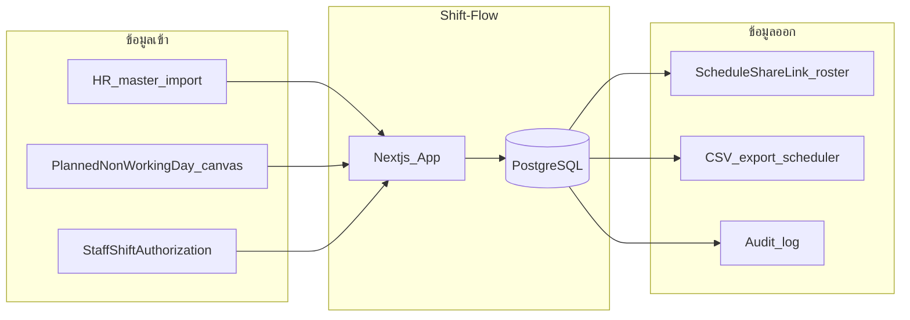

# Data Policy — Shift-Flow

> อัปเดต: 2026-08-13  
> อ้างอิง: พ.ร.บ. คุ้มครองข้อมูลส่วนบุคคล พ.ศ. 2562  
> ขอบเขต: จัดตารางเวรบุคลากร — ไม่เก็บข้อมูลผู้ป่วยหรือผลตรวจ

---

## 1. หลักการ

1. **Data minimization** — เก็บเฉพาะที่จำเป็นต่อการจัดเวร ความปลอดภัย และ audit
2. **Purpose limitation** — ใช้ข้อมูลเพื่อ scheduling/workforce เท่านั้น
3. **Org isolation** — ข้อมูลแยกตาม organization
4. **No PHI** — ไม่เก็บข้อมูลผู้ป่วยหรือผลตรวจ
5. บุคลากรดูตารางผ่าน **share link** — ไม่ต้องมีบัญชี login แยก
6. วันหยุด/ลาอยู่ใน `PlannedNonWorkingDay` บน canvas — ไม่มี workflow ลาแยก

---

## 2. ข้อมูลที่ห้ามเก็บ

| ข้อมูล                                        | เหตุผล                    | ทางเลือกที่อนุญาต                          |
| ------------------------------------------- | ------------------------ | -------------------------------------- |
| รายละเอียดอาการ/การวินิจฉัย                     | PDPA + ไม่จำเป็นต่อการจัดเวร  | หมวด leave เช่น "ลาป่วย" โดยไม่มีรายละเอียด |
| ใบรับรองแพทย์ / เลขที่เอกสารแพทย์                | sensitive health data    | เก็บในระบบ HR แยกต่างหาก                 |
| ข้อมูลผู้ป่วย (HN, ชื่อ, ผลตรวจ)                   | นอกขอบเขตโครงการ         | —                                      |
| เลขบัตรประชาชน / บัญชีธนาคาร                   | ไม่จำเป็นต่อ scheduling core | HRIS / payroll system                  |
| รหัสผ่าน plain text                           | security                 | Argon2id hash เท่านั้น                    |
| Push token หรือ share token แบบ plain ใน log | security                 | hash / redacted                        |

---

## 3. บัญชีข้อมูล

### 3.1 Identity & Access

| Entity                 | Field              | ประเภทข้อมูล   | Purpose          | Access roles            | Retention               |
| ---------------------- | ------------------ | ------------ | ---------------- | ----------------------- | ----------------------- |
| User                   | username           | ข้อมูลระบุตัว    | login            | Self, SYSTEM_ADMIN      | ตลอด account + 1 ปีหลังปิด |
| User                   | passwordHash       | security     | authentication   | ระบบเท่านั้น               | ตลอด account            |
| User                   | displayName, email | ข้อมูลระบุตัว    | แสดงใน UI / ติดต่อ | SYSTEM_ADMIN, SCHEDULER | ตาม account             |
| OrganizationMembership | role               | ไม่ sensitive | authorization    | SYSTEM_ADMIN            | ตาม membership          |

บทบาทในระบบมีสองค่า: `SYSTEM_ADMIN` และ `SCHEDULER` — ดู [`../security/rbac.md`](../security/rbac.md)

### 3.2 Staff & Employment

| Entity             | Field            | ประเภทข้อมูล   | Purpose             | Access roles            | Retention                   |
| ------------------ | ---------------- | ------------ | ------------------- | ----------------------- | --------------------------- |
| StaffProfile       | staffCode        | pseudonym    | อ้างอิงภายใน          | SCHEDULER, SYSTEM_ADMIN | ตลอด employment + 7 ปี audit |
| StaffProfile       | displayName      | ข้อมูลระบุตัว    | roster + share page | SCHEDULER, share link   | ตาม employment              |
| EmploymentContract | fte, hoursTarget | ไม่ sensitive | fairness, coverage  | SCHEDULER, SYSTEM_ADMIN | ตาม contract + audit period |

### 3.3 สิทธิปฏิบัติงานตามรหัสเวร

โมเดล `Competency` / `StaffCompetencyAuthorization` ถูกลบแล้ว — สิทธิ์ผูก `StaffShiftAuthorization` ต่อ `shiftCodeId` (หรือ `coversAllShiftCodes`)

| Entity                  | Field                            | ประเภทข้อมูล   | Purpose               | Access roles            | Retention            |
| ----------------------- | -------------------------------- | ------------ | --------------------- | ----------------------- | -------------------- |
| StaffShiftAuthorization | shiftCodeId, coversAllShiftCodes | ไม่ sensitive | assignment validation | SCHEDULER, SYSTEM_ADMIN | ตาม ISO record + 7 ปี |
| StaffShiftAuthorization | assessedAt, expiresAt            | ไม่ sensitive | ตรวจวันหมดอายุ          | SCHEDULER, SYSTEM_ADMIN | ตาม ISO              |
| StaffShiftAuthorization | authorizedByStaffId              | ข้อมูลระบุตัว    | audit                 | SYSTEM_ADMIN            | ตาม ISO              |

### 3.4 Planned non-working days

| Entity               | Field                   | ประเภทข้อมูล   | Purpose          | Access roles | Retention         |
| -------------------- | ----------------------- | ------------ | ---------------- | ------------ | ----------------- |
| PlannedNonWorkingDay | localDate, kind, source | ไม่ sensitive | block assignment | SCHEDULER    | ตาม draft/version |
| NonWorkingDayKind    | code, displayName       | ไม่ sensitive | หมวดวันหยุด/ลา     | SCHEDULER    | ตลอดใช้งาน config  |

หมวดลาเป็น operational เท่านั้น — ไม่เก็บรายละเอียดสุขภาพ

### 3.5 Scheduling

| Entity            | Field                | ประเภทข้อมูล   | Purpose         | Access roles          | Retention              |
| ----------------- | -------------------- | ------------ | --------------- | --------------------- | ---------------------- |
| ScheduleVersion   | publishedAt, status  | ไม่ sensitive | roster truth    | SCHEDULER, share link | 7 ปี                    |
| Assignment        | staffId, shift, area | ไม่ sensitive | roster          | SCHEDULER, share link | 7 ปี                    |
| ScheduleRun       | inputChecksum, seed  | ไม่ sensitive | reproducibility | SCHEDULER             | 2 ปี                    |
| ScheduleShareLink | tokenHash, expiresAt | security     | share export    | SCHEDULER             | ตาม expiry + 7 ปี audit |
| ScheduleShareLink | viewCount            | ไม่ sensitive | usage metric    | SCHEDULER             | ตาม link               |

**Share link = data export:** หน้า `/s/{token}` ส่งออกเฉพาะ `displayName` + รหัสเวร/วันหยุด + ช่วงเวลา — ไม่ส่ง staffCode, email, สิทธิรหัสเวร, OT รายละเอียด

### 3.6 Audit & Security

| Entity     | Field                  | ประเภทข้อมูล   | Purpose    | Access roles | Retention |
| ---------- | ---------------------- | ------------ | ---------- | ------------ | --------- |
| AuditEvent | actor, action, diff    | อาจมี PII     | compliance | SYSTEM_ADMIN | 7 ปี       |
| Auth log   | IP (masked), timestamp | ไม่ sensitive | security   | DPO, IT      | 90 วัน     |

---

## 4. Data flow

ไม่มี flow จากระบบไปยัง HRIS โดยตรงในรุ่นแรก

---

## 5. สิทธิของเจ้าของข้อมูล

องค์กร (data controller) รับผิดชอบแจ้งวัตถุประสงค์, ตอบคำขอเข้าถึง/แก้ไข/ลบ และแจ้ง breach ต่อ สคส. ภายใน 72 ชม. เมื่อเข้าเกณฑ์

| สิทธิ์                 | วิธีดำเนินการ                      | ผู้รับผิดชอบ          | SLA        |
| ------------------- | ------------------------------ | ----------------- | ---------- |
| ขอเข้าถึง             | คำขอผ่าน HR/DPO → export จากระบบ | DPO               | 30 วัน      |
| แก้ไข                | แก้ผ่าน admin/HR verified        | HR + SYSTEM_ADMIN | 14 วัน      |
| ลบ                  | หลัง retention หรือ anonymize    | DPO               | ตาม policy |
| คัดค้าน / ถอน consent | จำกัด share link (revoke)        | DPO               | 30 วัน      |

ระบบรองรับ: export roster CSV, deactivate account (`UserStatus.DISABLED`), audit trail สำหรับ correction

---

## 6. Retention (แนะนำ — org ปรับได้)

| ข้อมูล                     | ระยะเก็บแนะนำ        |
| ------------------------ | ------------------ |
| Published roster + audit | ≥ 3 ปี (HR/quality) |
| Draft ที่ไม่ publish        | 90 วัน              |
| Auth logs (redacted)     | 90 วัน              |
| Session                  | 8 ชม. max          |

---

## 7. Logging และ metrics

- Logs **redact** password, token, email, username, share token plain
- Metrics **ไม่มี** PII ใน labels
- Correlation ID ใช้ trace ไม่ใช่ identify โดยตรง
- IP ใช้ /24 mask หรือ hash

Implementation: `src/lib/observability/redact.ts`

---

## 8. การโอนข้อมูล / sub-processor

| Sub-processor | วัตถุประสงค์          | ที่ตั้ง              |
| ------------- | ------------------ | ---------------- |
| Neon          | PostgreSQL hosting | ตาม region ที่เลือก |
| Vercel        | App hosting        | Global CDN       |

Org ต้องทำ DPA กับ sub-processor เอง

---

## 9. Pilot data

- ข้อมูลจริงจากหน้างานอยู่ `pilot-vault/` (gitignore)
- Repo ใช้ synthetic demo เท่านั้น
- ห้าม commit PII ลง `docs/` หรือ `demo/`
