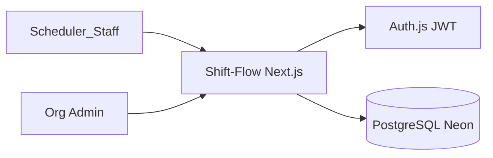

# Threat Model — Shift-Flow

> อัปเดต: 2026-08-13  
> ขอบเขต: lab shift scheduling (ไม่มี PHI)  
> Method: STRIDE-lite สำหรับ web app + multi-tenant data store

---

## 1. System Context

**Trust boundaries:**

- Browser ↔ App (untrusted client)
- App ↔ Database (tenant-scoped queries)

---

## 2. Assets

| Asset                             | Sensitivity               | Owner       |
| --------------------------------- | ------------------------- | ----------- |
| Staff roster, leave, availability | Internal — personal data  | Org HR/DPO  |
| Competency authorization          | Internal — quality/safety | Lab quality |
| Published schedule                | Internal — operational    | Scheduler   |
| Credentials / sessions            | Secret                    | IT          |
| Audit log                         | Integrity-critical        | Compliance  |

---

## 3. STRIDE Analysis

| Threat              | ตัวอย่าง                                 | Mitigation                                      | Test/Control                              |
| ------------------- | -------------------------------------- | ----------------------------------------------- | ----------------------------------------- |
| **Spoofing**        | ขโมย session, fake login               | Argon2id, JWT + `tokenVersion`, invite-only     | E2E security, revoked session test        |
| **Tampering**       | แก้ published roster in-place           | Immutable revision, optimistic lock, audit      | Lifecycle unit tests                      |
| **Repudiation**     | ปฏิเสธการ override                      | Append-only `AuditEvent`, correlation ID        | Audit integration                         |
| **Info Disclosure** | Cross-tenant read, verbose login error | Scoped repository, generic error, log redaction | Integration tenant test, redact unit test |
| **DoS**             | Login flood, solver bomb               | Rate limit, workflow timeout, p95 gate          | Rate limit unit test                      |
| **Elevation**       | STAFF แก้ config                        | RBAC matrix, DB membership check ทุก mutation    | RBAC unit tests                           |

---

## 4. Top Risks (P0)

### R1 — Cross-tenant data access

- **Impact:** สูง — ข้อมูลบุคลากร org อื่นรั่ว
- **Controls:** `organizationId NOT NULL`, scoped repository, updateMany + org filter
- **Residual:** RLS ยังไม่เปิด — **gate ก่อน tenant ที่สอง**
- **Tests:** `tests/integration/tenant-boundary.test.ts`

### R2 — Hard safety constraint bypass

- **Impact:** สูง — overlap, expired competency, unconfirmed code
- **Controls:** Invariants locked `NEVER`, revalidate ใน transaction
- **Tests:** `tests/unit/constraint-engine.test.ts`

### R3 — Credential attack

- **Impact:** กลาง–สูง
- **Controls:** Rate limit 5/15min, generic error, no public signup
- **Tests:** `tests/unit/security-rate-limit.test.ts`, E2E security spec

### R4 — Config tampering ปิด safety rule

- **Impact:** สูง
- **Controls:** Hard invariants ไม่ปิดได้, `ConfigChangeEvent` audit
- **Tests:** Rule registry + admin permission tests

### R5 — Backup failure / slow restore

- **Impact:** สูง — ไม่จัดเวรได้
- **Controls:** Neon PITR, logical backup, fallback export
- **Drill:** `scripts/backup-restore-drill.sh`

---

## 5. Security Controls (Implemented)

| Control          | Implementation                        |
| ---------------- | ------------------------------------- |
| Password hashing | Argon2id (`src/lib/auth/password.ts`) |
| Session revoke   | `tokenVersion` ใน JWT callback        |
| Rate limiting    | `src/lib/security/rate-limit.ts`      |
| Security headers | `src/middleware.ts`                   |
| Log redaction    | `src/lib/observability/redact.ts`     |
| Correlation ID   | `x-correlation-id` header             |
| Secret scan      | CI gitleaks                           |
| Dependency audit | CI `pnpm audit`                       |

---

## 6. Out of Scope (explicit)

- Physical access to lab
- Compromise of Neon/Vercel platform itself
- Social engineering of scheduler
- Legal compliance guarantee (policy engine only)

---

## 7. Review Cadence

- ทบทวนเมื่อ: เพิ่ม tenant ที่สอง, เปิด payroll, เปลี่ยน auth provider
- Owner: IT security + maintainer
